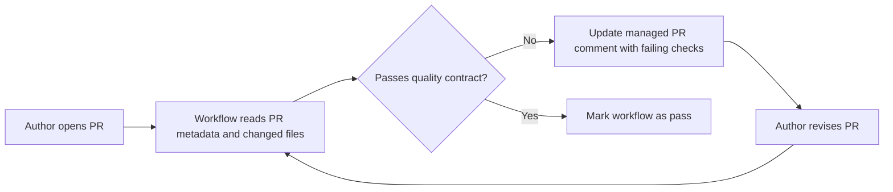

When working with interns, a good chunk of pull request review time ends up going to the same formalities: missing descriptions, vague titles, assignees left blank. These comments don't carry much technical weight, but they pile up and eat into the time I'd rather spend on actual guidance. So I built an agentic workflow to catch that stuff automatically. The full sample is available at [lfarci/pull-request-quality-checks](https://github.com/lfarci/pull-request-quality-checks).

# The Experiment

The workflow validates that pull requests follow the team contract for pull request quality. It does not review code.

I scoped it to title format, description structure, section coherence against actual changed files, assignee presence, and PR scope focus. Implementation review, correctness, test quality, and architecture are deliberately out of scope — that smaller contract is much easier to trust.

# How It Works

The workflow runs on every PR event (opened, edited, synchronize, reopened). It reads PR metadata and changed files, runs six quality checks, and updates a single managed comment on the PR with only the failing items.



When everything passes, the workflow resolves cleanly without leaving extra noise. When something fails, the comment tells the author exactly what to fix. That precision matters for interns: "Improve your PR description" is not actionable. "The `Why` section restates what changed without explaining the motivation" is.

# The Workflow Source

GitHub Agentic Workflows are defined as Markdown files with a YAML front matter block. The workflow source lives at `.github/workflows/pull-request-quality-checks.md` and looks like this:

```yaml
---
name: PR Quality Check
description: Validates PR title, description completeness, assignee presence, and scope focus.

on:
  pull_request:
    types: [opened, edited, synchronize, reopened, labeled, unlabeled, assigned, unassigned]
  skip-bots: [dependabot, renovate, github-actions]

permissions:
  contents: read
  pull-requests: read
  issues: read

engine:
  id: copilot
  model: gpt-5-mini

tools:
  github:
    toolsets: [default]

safe-outputs:
  jobs:
    upsert-pr-quality-comment:
      description: Create or update the singleton PR quality comment for the current PR.
      runs-on: ubuntu-latest
      output: Upserted PR quality comment.
      permissions:
        contents: read
        issues: write
        pull-requests: write
      inputs:
        body:
          description: The full PR quality comment body.
          required: true
          type: string
        item_number:
          description: The pull request number to comment on.
          required: false
          type: string
        create_if_missing:
          description: Whether to create the comment when none already exists.
          required: false
          type: boolean
      steps:
        - name: Upsert managed PR quality comment
          uses: ./.github/actions/upsert-pr-quality-comment
          with:
            github-token: ${{ secrets.GH_AW_GITHUB_TOKEN || secrets.GITHUB_TOKEN }}
            marker: "<!-- pr-quality-check-bot -->"
---
```

The `safe-outputs` block defines a callable action the Copilot agent can invoke to post or update the managed PR comment. The agent instructions (the Markdown body below the front matter) tell it exactly when to call this output and with what content.

You compile this source into a standard GitHub Actions YAML using the [`gh aw`](https://github.com/github/gh-aw) CLI:

```bash
gh aw compile
```

This regenerates `.github/workflows/pull-request-quality-checks.lock.yml`. Never edit the `.lock.yml` directly — it is auto-generated and will be overwritten on the next compile.

# The Core Pattern: Shared Skill

The most interesting part of this experiment is how the PR quality rules are defined once and consumed in two places.

The VS Code agent at `.github/agents/pr-quality-validator.agent.md` uses the same rules to coach authors locally before they push. Its YAML front matter wires it into Copilot Chat:

```yaml
---
description: "Use this agent when the user asks to validate or improve pull requests
  for team convention compliance.

  Trigger phrases include:
  - 'check if my PR meets team conventions'
  - 'validate my PR description'
  - 'does this PR follow our standards?'
  - 'help me write a better PR description'
  "
name: Pull Request Quality Validator
tools: [read/terminalSelection, read/terminalLastCommand, read/readFile, read/viewImage, search]
---
```

The validation rules themselves live in `.github/workflows/pull-request-quality-checks.md` (the workflow source). Both the agentic workflow and the VS Code agent point to the same contract — the workflow enforces it on every PR, the editor agent helps authors comply before pushing.

# Repository Structure

```
.github/
├── actions/
│   └── upsert-pr-quality-comment/   # Posts or updates the managed PR comment
├── agents/
│   └── pr-quality-validator.agent.md # VS Code Copilot Chat agent definition
└── workflows/
    ├── pull-request-quality-checks.md      # Workflow source (edit this)
    └── pull-request-quality-checks.lock.yml # Compiled output (auto-generated)
```

# What The Workflow Checks

| Check | What It Validates |
|-------|-------------------|
| A | Title follows Conventional Commits format |
| B | Description explains why the change is needed |
| C | Description summarizes what was changed |
| D | Description explains how the change was validated |
| E | At least one assignee is set |
| F | PR is focused on a single concern |

# Setup

1. Copy the `.github/` folder from [lfarci/pull-request-quality-checks](https://github.com/lfarci/pull-request-quality-checks) into your repository.
2. Add a `COPILOT_GITHUB_TOKEN` secret in **Settings → Secrets and variables → Actions**.
3. The workflow triggers automatically on pull request events — no further configuration required.

To modify the validation rules, edit the workflow source (`.github/workflows/pull-request-quality-checks.md`) and recompile:

```bash
gh aw compile
```

# What I Learned

**Start with a narrow contract.** A small contract with clear pass/fail boundaries is much easier to evaluate than "build an AI PR reviewer."

**Shared skills prevent drift.** Without one source of truth, the workflow and the editor agent would define PR quality independently. Change a rule in one place and the other falls out of sync.

**Scope control builds trust.** The workflow does not pretend to do everything. It validates one thing clearly and that makes it easier to trust and extend.

# References

- [lfarci/pull-request-quality-checks](https://github.com/lfarci/pull-request-quality-checks) — full sample repository
- [GitHub Agentic Workflows documentation](https://docs.github.com/en/copilot/using-github-copilot/using-copilot-agentic-workflows)
- [gh-aw CLI](https://github.com/github/gh-aw) — compile workflow sources to GitHub Actions YAML
- [Customizing Copilot in VS Code](https://code.visualstudio.com/docs/copilot/copilot-customization)
- [Conventional Commits specification](https://www.conventionalcommits.org/)
