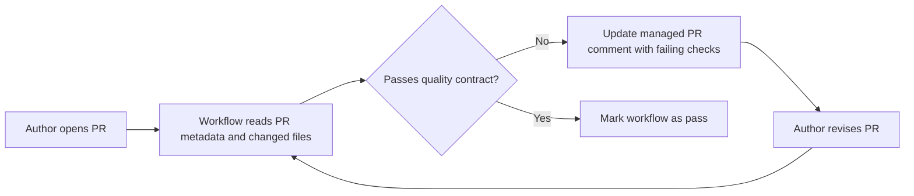
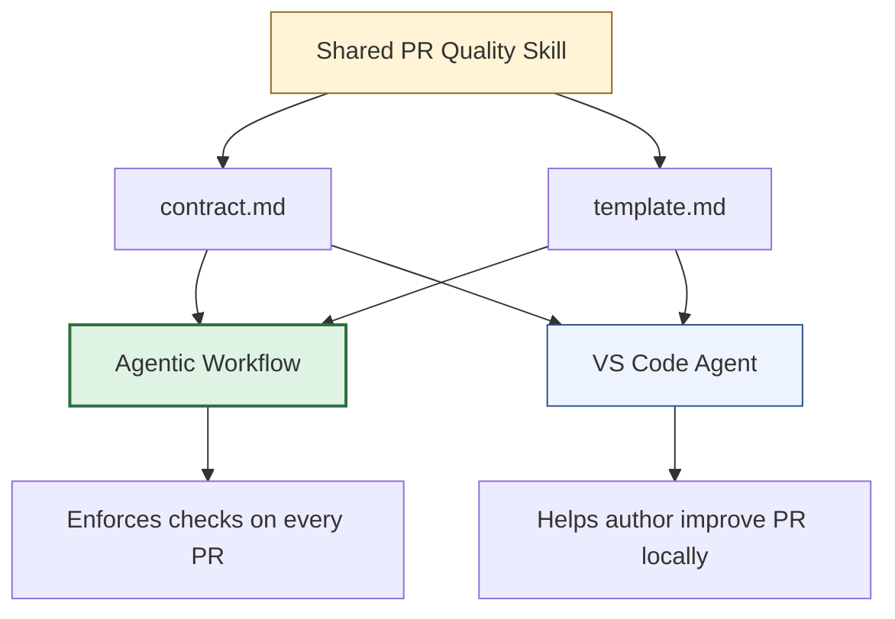

I started experimenting with agentic workflows by picking a narrow, high-signal problem: helping interns submit better pull requests.

PR quality checks are repetitive, benefit from consistency, and are exactly the kind of thing new contributors struggle with first. Instead of treating this as a documentation problem alone, I wanted to see what happened when I made it an agentic workflow problem.

# Why Intern PRs?

Interns learn several things at once: the codebase, the team workflow, the review culture, and the difference between "I changed code" and "I explained the change clearly."

When the review loop starts with missing sections or vague explanations, reviewers spend time correcting process instead of helping with engineering. My goal was simple: build an agentic workflow that catches the boring-but-important PR quality issues early, gives actionable feedback, and stays consistent every time.

# The Experiment

The workflow validates that pull requests follow the team contract for PR quality. It does not review code.

I scoped it to:
- PR title format (Conventional Commits)
- PR description structure (required sections)
- Section coherence against actual changed files
- Assignee presence
- PR scope focus

And I deliberately kept it away from implementation review, correctness, test quality, or architecture.

That smaller scope made the experiment easier to reason about and trust.

# How It Works

The workflow runs on every PR event (opened, edited, synchronize, reopened). It reads the PR metadata and changed files, runs nine quality checks, and updates a single managed comment on the PR with only the failing items.

When everything passes, the workflow resolves cleanly without leaving extra noise. When something fails, the comment tells the author exactly what to fix:

- Missing required sections
- Weak explanation in `Why`
- Vague validation notes
- No assignee
- Unrelated changes bundled together

That precision matters for interns. "Improve your PR description" is not actionable. "The `Why` section restates what changed without explaining the motivation" is.

# The Core Pattern: Shared Skill

The most interesting part of this experiment is how the PR quality rules are defined once and consumed in two places.

The shared skill lives in `.github/skills/pr-quality-checks/` and contains:
- **`contract.md`**: the nine validation checks with pass/fail criteria
- **`template.md`**: the expected PR description format

The **agentic workflow** imports the contract at compile time using `{{#runtime-import}}` and enforces it automatically on every PR. The **VS Code agent** points to the same files and helps authors understand and apply the rules before pushing.

The workflow is the enforcement layer. The VS Code agent is the coaching layer. Both stay aligned because they read from the same source of truth.

# What The Workflow Checks

| Check | What It Validates |
|-------|-------------------|
| A | Title follows Conventional Commits |
| B | Required PR sections are present |
| C | `Why` section explains motivation clearly |
| D | `What Changed` section matches actual diff |
| E | `Validation / Tests` section provides concrete evidence |
| F | `Screenshots` section is coherent (if present) |
| G | `Linked Issue` section is coherent (if present) |
| H | At least one assignee is set |
| I | PR is focused on a single concern |

# Why The Workflow Matters More Than The Editor

The VS Code agent is useful, but it depends on whether someone used it at the right time. The workflow enforces the standard the same way for everyone.

That is the split I wanted to explore:
- **Workflow** for enforcement
- **Editor agent** for coaching

If the policy only exists in an editor assistant, compliance is optional. In the workflow, it is guaranteed.

# Why Shared Skills Matter

Without a shared skill, I would maintain two separate definitions of PR quality. That means drift becomes the default.

With one source of truth:
- Tighten the title rules and both surfaces stay aligned
- Change the required sections and both surfaces stay aligned
- Improve the remediation wording and both surfaces stay aligned

That reuse matters more as the number of agents grows.

# What I Learned

**Start with a narrow contract.** My first instinct could have been "build an AI PR reviewer." That would have been too broad. A small contract with clear pass/fail boundaries is much easier to evaluate.

**Interns need precise feedback.** The workflow is useful because it says exactly what is wrong, not "improve your description." New contributors need specific guidance.

**Shared skills bridge automation and local guidance.** The workflow and the VS Code agent have different roles but share the same policy. That reduces maintenance and makes the system feel coherent.

**Scope control builds trust.** The workflow does not pretend to do everything. It validates one thing clearly and that makes it easier to trust.

# What's Next

If I keep pushing this experiment, I would explore:
- A GitHub PR template file that mirrors the shared contract
- Automated detection of workflow drift between source and compiled output
- Extending the same pattern to documentation or issue quality checks
- Measuring whether this reduces reviewer back-and-forth for new contributors

But even in its current form, the main lesson is already clear: the workflow should own enforcement, shared skills should own the policy, and local agents should help people comply before automation steps in.

# References

- [GitHub Agentic Workflows documentation](https://docs.github.com/en/copilot/using-github-copilot/using-copilot-agentic-workflows)
- [Customizing Copilot in VS Code](https://code.visualstudio.com/docs/copilot/copilot-customization)
- [Conventional Commits specification](https://www.conventionalcommits.org/)
