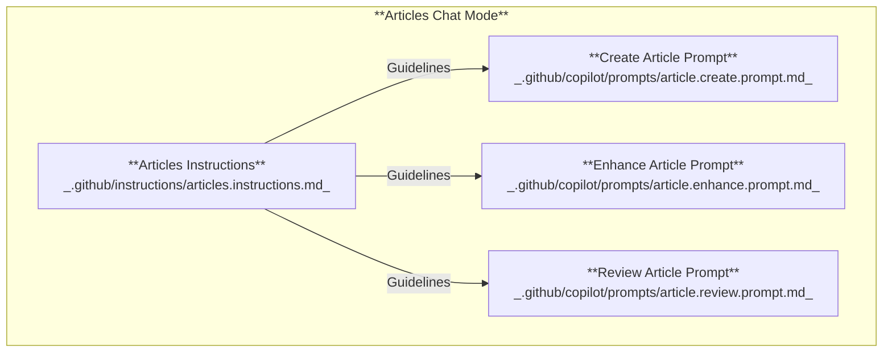
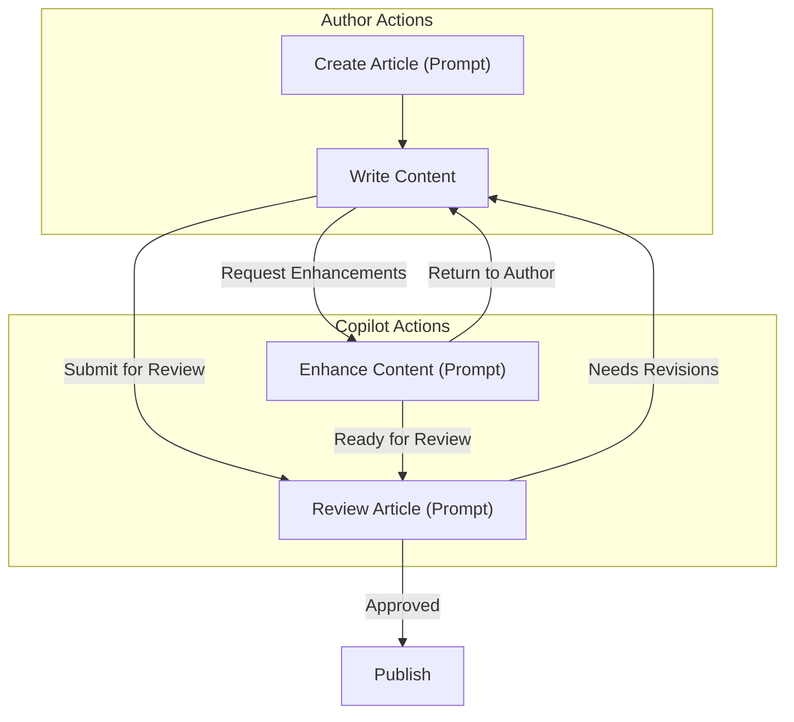

This website is my technical workspace, a place to document findings, experiments, and lessons learned for myself and other developers. I use it to publish focused articles about current projects or topics I’m exploring, knowing the content will evolve over time. My goal is to keep these notes clear and actionable, whether for my own reference or for anyone else who finds them.

While writing my first two articles ([MCP fundamentals](https://www.loganfarci.com/articles/mcp) and [GitHub MCP Server](https://www.loganfarci.com/articles/github-mcp-server)), I found GitHub Copilot surprisingly effective as a collaborator. It helped me:

-   Scaffold new articles and enforce the required front matter format
-   Catch spelling and grammar issues
-   Refine tone and style for technical clarity
-   Review drafts and provide actionable feedback

However, I quickly noticed a recurring problem: I was repeating the same instructions to Copilot in every session. My most common prompts were things like `Enhance this specific section and make it smoother`, `Update the article description and title`, or `Remove duplication across the article`. These requests were short and lacked context, making it impractical to provide full background each time. Copilot works best when it has the complete picture.

# Customizing GitHub Copilot

GitHub Copilot now supports powerful customization features in Visual Studio Code. I decided to leverage these capabilities to streamline my writing workflow and eliminate repetitive instructions. By customizing Copilot, I can automate common tasks like article reviews, edits, and scaffolding, ensuring every article remains consistent and follows established guidelines.

What does customization actually offer? You can now tailor Copilot’s responses by adding version-controlled instructions and reusable prompts directly to your repository. Simply create Markdown files that define exactly how Copilot should behave for your workflows. This lets you set global instructions, task-specific rules, reusable prompts, and custom chat modes. For more details, refer to the official [Customize AI responses](https://code.visualstudio.com/docs/copilot/copilot-customization) documentation.

Key customization features in VS Code include:

-   [Custom instructions](https://code.visualstudio.com/docs/copilot/copilot-customization#_custom-instructions)**:** Persistent guidelines automatically included in chat sessions.
-   [Prompt files](https://code.visualstudio.com/docs/copilot/copilot-customization#_prompt-files-experimental)**:** Reusable, parameterized prompts for common tasks.
-   [Custom chat modes](https://code.visualstudio.com/docs/copilot/chat/chat-modes#_custom-chat-modes)**:** Control how Copilot interacts with your codebase and tools for different workflows. I recommend this [video](https://www.youtube.com/watch?v=rE6svXzyhg0&t=278s) to have a walkthrough.

These features standardize Copilot’s behavior and ensure consistency across writing and development workflows. This article shows how I use them to set up an effective technical writing assistant.

# Create a technical writing assistant

This section explains how to use Copilot customization to build an efficient technical writing assistant. By integrating these features into my workflow, I’ve streamlined article creation and editing for this website. The goal is to improve quality and consistency without repeating instructions in every session.

The diagram below illustrates the main elements involved in customizing Copilot for technical writing:



### Articles Chat Mode

Imagine Articles Chat Mode as Copilot stepping into the role of a technical writing professional. Instead of juggling code reviews and bug fixes, Copilot now orchestrates your writing workflow, setting the stage, choosing the right tools, and focusing feedback on clarity and structure. This mode doesn’t rewrite your content rules or style guide; it simply ensures Copilot’s actions and suggestions are tailored for technical writing, not coding.

For example, when you switch to Articles Chat Mode, Copilot stops offering code completions or debugging tips. Instead, it reviews your Markdown, polishes your prose, and highlights areas for improvement, just like a dedicated editor. If you ask for a section rewrite, Copilot draws on your repository’s writing guidelines and prompt files, not generic programming advice.

To activate Articles Chat Mode, define it in `.github/copilot/chatmodes/articles.chatmode.md`. Once set up, select it from the Copilot chat mode picker in Visual Studio Code. This instantly shifts Copilot’s persona to match your technical writing workflow, making every edit session more focused and productive.

> ![NOTE]  
> I'm sure this mode can be improved further, but it already helps me focus on writing without getting distracted by coding tasks. It’s like having a personal writing assistant that understands my style and needs.

### Articles Instructions

Articles Instructions are the single source of truth for technical articles in this repository. They enforce consistent quality, structure, and formatting for all Markdown files in `content/articles/`. The full guidelines are versioned in `.github/instructions/articles.instructions.md` and refined over time.

Key requirements for every article:

-   Use clear, concise language in active voice
-   Focus on one problem or concept; avoid tangents
-   Link to official documentation instead of re-explaining basics
-   Include relevant keywords naturally for SEO
-   Start each article with complete front matter: `title`, `description`, `publishedAt`, `featured`, `tags`, `author`, `coauthoredWithAgent`.

Refer to my full [Articles Instructions](https://github.com/lfarci/loganfarci.com/blob/main/.github/instructions/articles.instructions.md) for details and the latest updates.

### Prompts

Prompts are reusable, parameterized templates for common tasks. Each prompt references the Articles Instructions to ensure consistent context. Use prompts for practical actions such as creating, enhancing, or reviewing articles to keep the workflow efficient and focused. Prompts act as "Job Descriptions" for Copilot, defining specific tasks and expectations for each assignment.

#### Create Article Prompt

I use the Create Article Prompt to scaffold new articles with the required front matter and structure. This template ensures that every article I start has a consistent, high-quality foundation.

**Example usage from my workflow:**

```shell
/article.create topic="New .NET 10 features" tags=".NET, C#" title="Exploring .NET 10"
```

This prompt generates a Markdown file in `content/articles/` with the correct front matter and a placeholder for content.

**Parameters:**

| **Input** | **Required** | **Description**                                                                                 |
| --------- | ------------ | ----------------------------------------------------------------------------------------------- |
| **topic** | Yes          | Short description of the article I want to write.                                               |
| **title** | No           | Optionally specify the article title. If omitted, Copilot generates a title based on the topic. |
| **tags**  | No           | Optionally specify tags. If omitted, Copilot suggests tags based on the topic.                  |

This prompt streamlines setup for me—I just provide a few details, and Copilot handles the rest. In the future, it could suggest outlines, generate draft sections, or pull in relevant references automatically. For now, it keeps things simple and leaves the content empty, but the foundation is ready for more advanced automation.

#### Enhance Article Prompt

I rely on the Enhance Article Prompt to improve the readability and clarity of my articles. It gives Copilot a structured way to refine content, fix grammar, and raise overall quality, always following the Articles Instructions. This prompt is flexible and adapts to my needs using the parameters below.

| **Input**   | **Required** | **Description**                                                                                                                                                                               |
| ----------- | ------------ | --------------------------------------------------------------------------------------------------------------------------------------------------------------------------------------------- |
| **article** | No           | Most of the time I don't provide a value, as this defaults to the opened file (`${file}`). In some scenarios, I specify a different article.                                                  |
| **section** | No           | I can provide a section title to focus enhancements on a specific section. If not provided, it enhances the selection.                                                                        |
| **mode**    | No           | I choose from several modes, each with its own instructions: `auto`, `shorten`, `expand`, `checks`, `simplify`, `creative`. This lets me tailor enhancements to my specific needs or context. |

For example, when I want to check for spelling and grammar issues, I use the `checks` mode:

`/article.enhance article=dotnet.md section=Introduction mode=checks`

To expand a section with more detail, I select the text and use the `expand` mode:

`/article.enhance mode=expand`

Most often, I run this prompt to apply generic enhancements based on the Articles Instructions while working on an article:

`/article.enhance`

This is the prompt I use most often. I jot down ideas quickly, then run this prompt to polish and refine the content. It helps me improve clarity, style, and structure—without getting bogged down in repetitive instructions.

#### Review Article Prompt

I use the Review Article Prompt as the final gatekeeper before publication, ensuring every article meets my quality standards. When I run this prompt, Copilot systematically checks for clarity, technical accuracy, and alignment with my writing guidelines, then suggests targeted improvements. For example, I might use:

```shell
/article.review
```

to trigger a comprehensive review of my draft. This process helps me catch overlooked issues and enforces consistency across my content, so every article published is polished and reliable.

# Workflow



# References

You can also enforce technology-specific best practices for your stack. The open-source community maintains lists of reusable instructions, such as [Awesome Copilot Instructions](https://github.com/Code-and-Sorts/awesome-copilot-instructions), which you can adapt for your projects.

For more examples, see [Awesome GitHub Copilot Customizations](https://github.com/github/awesome-copilot) or [Awesome Copilot Instructions](https://github.com/Code-and-Sorts/awesome-copilot-instructions).
