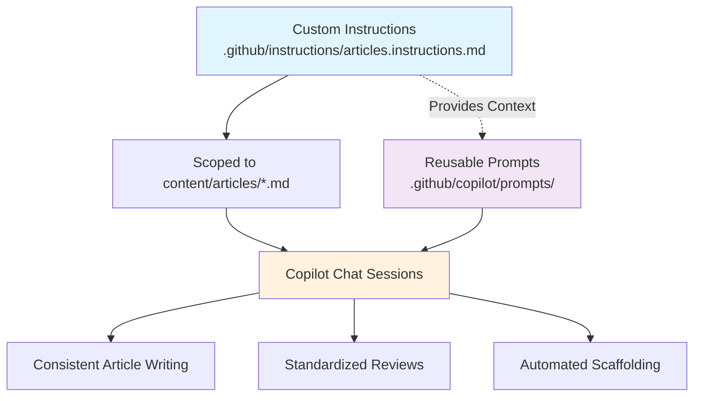

You can tailor GitHub Copilot's responses by adding version-controlled instructions and reusable prompts directly to your repository. Create markdown files that specify exactly how you want Copilot to behave for your workflows. This approach lets you define global instructions, task-specific rules, reusable prompts, and even custom chat modes. For details, see the official [Customize AI responses](https://code.visualstudio.com/docs/copilot/copilot-customization) documentation.

I've adopted these features to streamline and improve my workflow on this personal website.



# Objective

This personal website is my space to collect and share content that interests me—and hopefully other developers. It's where I document findings, experiments, and lessons learned, primarily for my future self. I use it to publish focused articles about whatever I'm currently working on or exploring, knowing the topics will shift over time. While I'm not a professional writer, I want my notes to be clear and useful, whether for myself or for anyone else who stumbles across them (even if that's just a curious future me).

In writing my first two articles, I found collaborating with Copilot surprisingly effective. So far, I've used Copilot to:

-   Scaffold new articles and ensure each file follows the required format (especially the front matter)
-   Catch spelling and grammar mistakes
-   Refine the tone and style of my writing
-   Review articles and provide actionable feedback

Through this process, I noticed I was repeating the same instructions to Copilot again and again. Typing out all the context each time isn't practical—and Copilot works best when it has the full picture. That led me to explore ways to streamline and automate these interactions.

# Instructions

One of the first challenges I faced was having to repeat the same instructions to Copilot across different sessions and prompts. For example, if I wanted Copilot to improve a section, I’d type something like: `Improve the readability and clarity of the section about X.` Copilot would make the edit, and I’d review it. But for more targeted changes, I had to explain my intent in detail every time. This quickly became tedious and didn’t scale.

The solution is to define persistent, version-controlled instructions using markdown files. [Custom instructions](https://code.visualstudio.com/docs/copilot/copilot-customization#_custom-instructions) make this possible.

I created a file called `.github/instructions/articles.instructions.md` in my repository. It contains all the guidelines and templates I want Copilot to follow when working on articles. This file is scoped to all Markdown files in the `content/articles` directory. Here’s a simplified example:

> [!NOTE]
> This is a simplified version of the instructions file used in this repository. The full version is available here: [articles.instructions.md](https://github.com/lfarci/loganfarci.com/blob/main/.github/instructions/articles.instructions.md).

```markdown
---
applyTo: "content/articles/*.md"
---

# Article Instructions

## Article Guidelines

-   Write for developers: clear, direct, and concise
-   Focus on one specific problem or concept per article
-   Use active voice and practical code examples
-   Structure with logical headings and minimal setup
-   Avoid tangents and broad overviews
-   Lead with code and practical implementation
-   Link to official docs for basics

## Front Matter

title: "[Specific Title]"
description: "[1-2 sentence summary]"
publishedAt: "[YYYY-MM-DD]"

## \`\`\`yaml

title: "[Specific Title]"
description: "[1-2 sentence summary]"
publishedAt: "[YYYY-MM-DD]"

---

\`\`\`

-   **title**: Use title case and be descriptive about the article content
-   **description**: Summarize the article's value in 1-2 sentences
-   **publishedAt**: Use YYYY-MM-DD format for consistency

## Structure Template

## \`\`\`markdown

## [front matter]

[Intro: what problem is solved]

## [Solution]

\`\`\`language
// Code example
\`\`\`

[Brief explanation]

## [Key Details]

[Important notes/config]

## [Usage]

[How to use or next steps]

---

_[Optional: links to docs or related articles]_
\`\`\`

## Checklist

-   [ ] Front matter complete
-   [ ] Title is specific
-   [ ] Focused on one topic
-   [ ] Code is tested and usable
-   [ ] No unnecessary tangents
-   [ ] Links to official docs
-   [ ] Tags are accurate
```

This custom instructions file provides the detail needed to enforce style and rules. It serves as a single source of truth for how Copilot should handle article writing in this repository. Because it’s scoped to the articles directory, you can have different instructions for different parts of your project if needed.

This approach standardizes Copilot’s behavior for your articles, ensuring consistent edits and reviews without restating your requirements each time.

The goal is to provide clear, actionable guidance to Copilot on the article writing process.

# Reusable Prompts

Reusable prompts are especially useful when you find yourself repeating the same instructions. This was particularly helpful when experimenting with the GitHub MCP Server. This feature allows you to create a parameterized prompt that can be reused across different tasks. For example, I created a reusable prompt for reviewing articles in my repository:

```markdown
mode: "agent"
model: GPT-4.1
tools: ["codebase", "Microsoft Docs"]
description: "Review a technical article in the loganfarci.com repository"

# Context

# Role

Act as a sceptical technical article reviewer and question the content of the article submitted for review. Provide feedback on the article's content, structure, and clarity. If the article is well-written and informative, approve it. If it requires significant changes or does not meet the standards, reject it with specific reasons for rejection.

Refer to the [Article Review Instructions file](../instructions/articles.instructions.md) for all formatting, templates, and conventions.
```

I can then use this prompt in my tasks by providing the article name as a parameter. This saves time and ensures consistency in my reviews.

```
/article.review article=my-awesome-article.md
```

GitHub maintains a repository with community-driven configuration for Copilot: [Awesome GitHub Copilot Customizations](https://github.com/github/awesome-copilot). See also the Microsoft blog post: https://devblogs.microsoft.com/blog/introducing-awesome-github-copilot-customizations-repo

Another great resource is [Awesome Copilot Instructions](https://github.com/Code-and-Sorts/awesome-copilot-instructions).

Reusable prompts let you define a template once and reuse it for similar tasks. For example, to review articles, you can create a simple prompt like:

```markdown
---
description: "Review a technical article"
---

Review the article at articles/${input:article} for clarity and accuracy.
```

You can then use this prompt by passing the article name as a parameter:

```
/article.review article=my-article.md
```

This approach saves time and keeps your reviews consistent.

For more examples, see [Awesome GitHub Copilot Customizations](https://github.com/github/awesome-copilot) or [Awesome Copilot Instructions](https://github.com/Code-and-Sorts/awesome-copilot-instructions).
