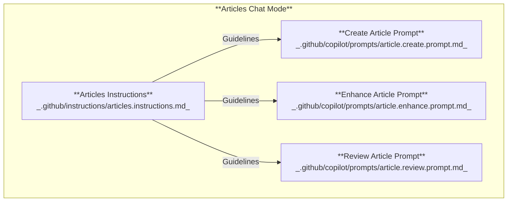
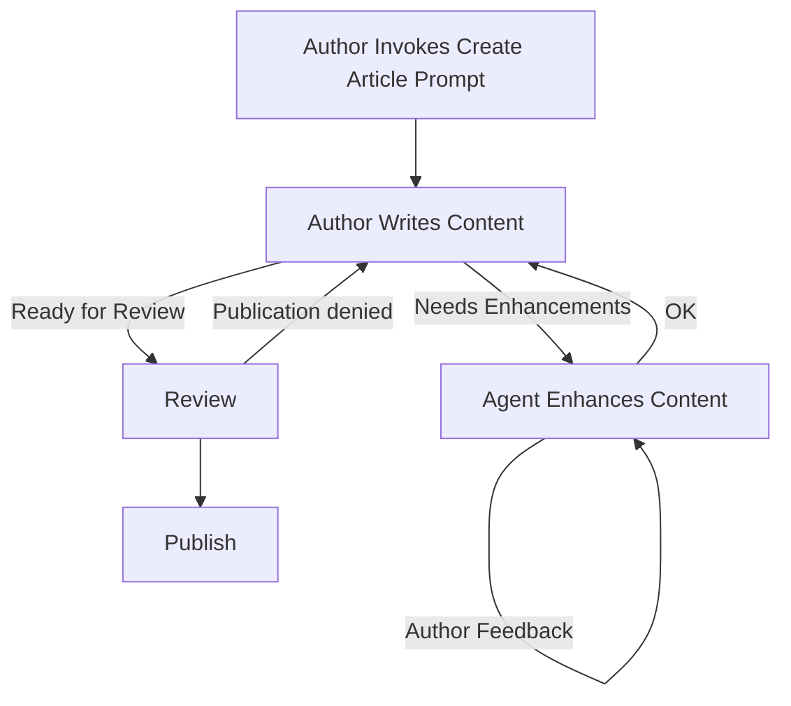

This website is my technical workspace—a place to document findings, experiments, and lessons learned for myself and other developers. I use it to publish focused articles about current projects or topics I’m exploring, knowing the content will evolve over time. My goal is to keep these notes clear and actionable, whether for my own reference or for anyone else who finds them.

While writing my first two articles ([MCP fundamentals](https://www.loganfarci.com/articles/mcp) and [GitHub MCP Server](https://www.loganfarci.com/articles/github-mcp-server)), I found GitHub Copilot surprisingly effective as a collaborator. It helped me:

-   Scaffold new articles and enforce the required front matter format
-   Catch spelling and grammar issues
-   Refine tone and style for technical clarity
-   Review drafts and provide actionable feedback

However, I quickly noticed a recurring problem: I was repeating the same instructions to Copilot in every session. My most common prompts were things like `Enhance this specific section and make it smoother`, `Update the article description and title`, or `Remove duplication across the article`. These requests were short and lacked context, making it impractical to provide full background each time. Copilot works best when it has the complete picture.

# Customizing GitHub Copilot

GitHub Copilot now supports powerful customization features in Visual Studio Code. I decided to leverage these capabilities to streamline my writing workflow and eliminate repetitive instructions. By customizing Copilot, I can automate common tasks like article reviews, edits, and scaffolding, ensuring every article remains consistent and follows established guidelines.

What does customization actually offer? You can now tailor Copilot’s responses by adding version-controlled instructions and reusable prompts directly to your repository. Simply create Markdown files that define exactly how Copilot should behave for your workflows. This lets you set global instructions, task-specific rules, reusable prompts, and custom chat modes. For more details, refer to the official [Customize AI responses](https://code.visualstudio.com/docs/copilot/copilot-customization) documentation.

Key customization features in VS Code include:

-   **[Custom instructions](https://code.visualstudio.com/docs/copilot/copilot-customization#_custom-instructions):** Persistent guidelines automatically included in chat sessions.
-   **Prompt files:** Reusable, parameterized prompts for common tasks.
-   **Custom chat modes:** Control how Copilot interacts with your codebase and tools for different workflows.

These features standardize Copilot’s behavior and improve consistency across your writing and development workflows.

# Create a technical writing assistant

This section explains how to use Copilot customization to build an efficient technical writing assistant. By integrating these features into my workflow, I’ve streamlined article creation and editing for this website. The goal is to improve quality and consistency without repeating instructions in every session.

The diagram below illustrates the main elements involved in customizing Copilot for technical writing:

### Articles Chat Mode

Think of Articles Chat Mode as Copilot putting on its technical editor hat. This mode shapes Copilot’s role, tools, and boundaries when working with articles, like switching between a code reviewer and a writing coach. It doesn’t dictate the content or style rules themselves, but it does control how Copilot approaches tasks, which tools it uses, and the kind of feedback it provides. For example, when you activate Articles Chat Mode, Copilot focuses on editing, reviewing, and enhancing Markdown articles, rather than suggesting code snippets or debugging tips. In short, it sets Copilot’s "persona" for technical writing sessions, ensuring its responses match your workflow needs.

### Articles Instructions

Articles Instructions are the single source of truth for technical articles in this repository. They enforce consistent quality, structure, and formatting for all Markdown files in `content/articles/`. The full guidelines are versioned in `.github/instructions/articles.instructions.md` and refined over time.

Key requirements for every article:

-   Use clear, concise language in active voice
-   Focus on one problem or concept; avoid tangents
-   Link to official documentation instead of re-explaining basics
-   Include relevant keywords naturally for SEO
-   Start each article with complete front matter: `title`, `description`, `publishedAt`, `featured`, `tags`, `author`, `coauthoredWithAgent`.

Refer to my full [Articles Instructions](https://github.com/lfarci/loganfarci.com/blob/main/.github/instructions/articles.instructions.md) for details and the latest updates.

### Prompts

Prompts are reusable, parameterized templates for common tasks. Each prompt references the Articles Instructions to ensure consistent context. Use prompts for practical actions such as creating, enhancing, or reviewing articles to keep the workflow efficient and focused. Prompts act as "Job Descriptions" for Copilot, defining specific tasks and expectations for each assignment.

#### Create Article Prompt

The Create Article Prompt is a reusable template for starting new articles. It includes the necessary front matter and structure, ensuring every article begins with a consistent format. This prompt can be used to scaffold new articles quickly, reducing setup time and maintaining uniformity across the repository.

[Reusable prompts](https://code.visualstudio.com/docs/copilot/copilot-customization#_prompt-files-experimental) Create parameterized prompts that can be reused across different sessions. They can reference the custom instructions and improve efficiency by avoiding repetitive explanations. For example, you can create a prompt for reviewing articles that references all the necessary context and guidelines.

#### Enhance Article Prompt

The Enhance Article Prompt is designed to improve the readability and clarity of existing articles. It provides a structured approach for Copilot to refine content, fix grammar, and enhance overall quality. This prompt ensures that enhancements align with the established guidelines in the Articles Instructions.

#### Review Article Prompt

The Review Article Prompt is used to evaluate articles for clarity, accuracy, and adherence to guidelines. It provides a framework for Copilot to assess content quality and suggest improvements. This prompt helps maintain high standards across all articles by ensuring thorough reviews before publication.

# Workflow

# References

You can also enforce technology-specific best practices for your stack. The open-source community maintains lists of reusable instructions, such as [Awesome Copilot Instructions](https://github.com/Code-and-Sorts/awesome-copilot-instructions), which you can adapt for your projects.

For more examples, see [Awesome GitHub Copilot Customizations](https://github.com/github/awesome-copilot) or [Awesome Copilot Instructions](https://github.com/Code-and-Sorts/awesome-copilot-instructions).
