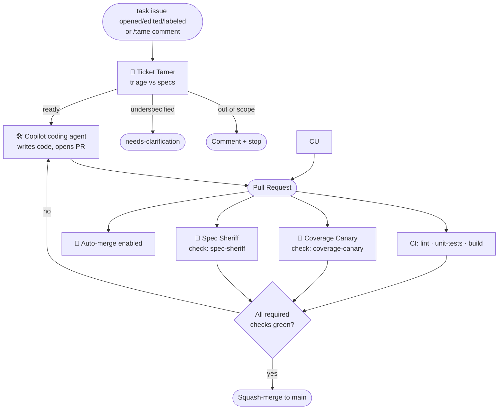

# Agentic Workflow Team

An autonomous engineering team for **loganfarci.com**, built on
[GitHub Agentic Workflows (gh-aw)](https://github.github.com/gh-aw/). You open an
issue, and a crew of role-specific agents takes it from triage to a merged pull
request — with strong, spec-based checks gating every merge.

The whole team is grounded in [`docs/specs/`](./specs/README.md): the specs are the
source of truth the agents read, enforce, and are measured against.

## The crew

| Agent | Role | Trigger | Workflow file |
| --- | --- | --- | --- |
| 🤠 **Ticket Tamer** | Triages a `task` issue and hands ready work to the Copilot coding agent | Issue labeled `task` (opened/edited/labeled); or `/tame` comment | [`agent-ticket-tamer.md`](../.github/workflows/agent-ticket-tamer.md) · [`agent-ticket-tamer-command.md`](../.github/workflows/agent-ticket-tamer-command.md) |
| 🛠️ Copilot coding agent | Writes the code and opens the PR | Assigned by the Ticket Tamer | *(GitHub-native)* |
| 🐤 **Coverage Canary** | Verifies changed code ships with tests | `pull_request` | [`agent-coverage-canary.md`](../.github/workflows/agent-coverage-canary.md) |
| 👮 **Spec Sheriff** | Reviews the diff against the specs (the gate) | `pull_request` | [`agent-spec-sheriff.md`](../.github/workflows/agent-spec-sheriff.md) |
| 🔀 Auto-merge | Enables native auto-merge on agent PRs | `pull_request` | [`auto-merge.yml`](../.github/workflows/auto-merge.yml) |

## The flow



1. You open (or label) an issue as a `task`. Features and bugs are triaged separately;
   only `task` issues are auto-dispatched. You can also comment `/tame` on any existing
   issue to invoke the Tamer on demand.
2. **Ticket Tamer** reads it, checks it against the specs, and either hands it to the
   Copilot coding agent, asks for clarification (`needs-clarification`), or flags it as
   out of scope (crosses a [non-goal](./specs/non-goals.md)). It skips issues already in
   flight (`agent:working`).
3. The **Copilot coding agent** implements the change and opens a PR (linked with
   `Fixes #N`).
4. On the PR, **Coverage Canary** and **Spec Sheriff** run in parallel with CI. Each
   posts a first-class status check (`coverage-canary`, `spec-sheriff`).
5. **Auto-merge** is enabled on the PR. GitHub squash-merges it **only** once every
   required check is green.
## Why it's safe

- **Read-only agents.** Each agent runs with read-only permissions. It can only affect
  GitHub through gh-aw [safe outputs](https://github.github.com/gh-aw/reference/safe-outputs/) —
  structured requests executed by separate, permission-scoped jobs. This is the primary
  defense against prompt injection.
- **Least privilege per role.** The reviewer and tester never get write access to code;
  the Ticket Tamer can only assign, comment, and label.
- **The gate is GitHub, not an agent.** No agent merges to `main`. Merges happen only
  through GitHub branch protection once required checks pass. The Spec Sheriff and
  Coverage Canary express their verdict as **required status checks**, so a failing
  review genuinely blocks the merge.
- **Independent review.** The agent that reviews a PR is a different run from the one
  that wrote the code — real third-party review, reinforced by CI.

## Setup

These are one-time repository configuration steps. Steps 3–4 are what make auto-merge
safe — do not enable auto-merge before branch protection is in place.

### 1. Secret: `GH_AW_AGENT_TOKEN`

The Ticket Tamer assigns issues to the Copilot coding agent, which needs a token with
Copilot access. Create a fine-grained PAT with the **Copilot Requests** permission (and
issue read/write for the target repo) and add it as a repository secret:

```bash
gh secret set GH_AW_AGENT_TOKEN --repo lfarci/loganfarci.com
```

GitHub Copilot coding agent must be enabled for the repository.

### 2. Labels

Create the labels the agents use (`feature`, `task`, `bug`, `agent:working`,
`needs-clarification`) by running the **Setup Repository Labels**
workflow once:

```bash
gh workflow run setup-labels.yml --repo lfarci/loganfarci.com
```

### 3. Enable auto-merge

Repository → **Settings → General → Pull Requests → Allow auto-merge**.

### 4. Branch protection on `main`

Protect `main` and require these status checks to pass before merging:

- `Run linter` (from `lint.yml`)
- `Run unit tests` (from `unit-tests.yml`)
- `spec-sheriff` (from the Spec Sheriff)
- `coverage-canary` (from the Coverage Canary)

Each check must run at least once before it can be selected as required. Example with
the API:

```bash
gh api -X PUT repos/lfarci/loganfarci.com/branches/main/protection \
  -H "Accept: application/vnd.github+json" \
  -f 'required_status_checks[strict]=true' \
  -f 'required_status_checks[checks][][context]=Run linter' \
  -f 'required_status_checks[checks][][context]=Run unit tests' \
  -f 'required_status_checks[checks][][context]=spec-sheriff' \
  -f 'required_status_checks[checks][][context]=coverage-canary' \
  -F 'enforce_admins=false' \
  -F 'required_pull_request_reviews=null' \
  -F 'restrictions=null'
```

> **Fork PRs:** the Spec Sheriff and Coverage Canary are gh-aw workflows that, for
> security, do not run on pull requests from forks. If you require `spec-sheriff` and
> `coverage-canary` as above, PRs opened from a fork can never produce those checks and
> will stay unmergeable. This repo's automated flow runs on same-repo branches (the
> Copilot coding agent pushes to a branch here), so that is fine. If you later need to
> accept fork PRs, drop those two from the required set (or merge them manually) and keep
> only `Run linter` / `Run unit tests` as required.

## Using the team

- **Kick off work:** open an issue and label it `task` (follow
  [`issues.instructions.md`](../.github/instructions/issues.instructions.md)). The Ticket
  Tamer picks it up automatically. For an existing issue, comment `/tame` to invoke it on
  demand.
- **Watch a run:** `gh aw logs <workflow-name>` or the Actions tab.
- **A PR is blocked:** read the Spec Sheriff / Coverage Canary check summaries — they
  cite the exact spec clause or the missing test.

## Maintaining the workflows

The `.md` files are the source; the compiled `.lock.yml` files are what GitHub Actions
runs. After editing any workflow `.md`, recompile:

```bash
gh aw compile          # regenerate all .lock.yml files
gh aw compile --validate
```

Commit both the `.md` and its `.lock.yml`. To change the crew's behavior, edit the
instructions in the workflow body — that markdown *is* each agent's persona. For gh-aw
authoring help, see the dispatcher agent at
[`.github/agents/agentic-workflows.agent.md`](../.github/agents/agentic-workflows.agent.md).

### Tuning tips

- **Too eager to fail a PR?** The Spec Sheriff only fails on `MUST`/`MUST NOT`
  violations; broaden or narrow that instruction in `agent-spec-sheriff.md`.
- **Auto-merge scope:** `auto-merge.yml` is gated to PRs authored by the Copilot coding
  agent (`login` starting with `copilot`). Adjust the `if:` there to widen or restrict.
- **Conflict resolution:** if a PR falls behind `main`, refresh it manually or ask the
  PR author / coding agent to update it before auto-merge can complete.
