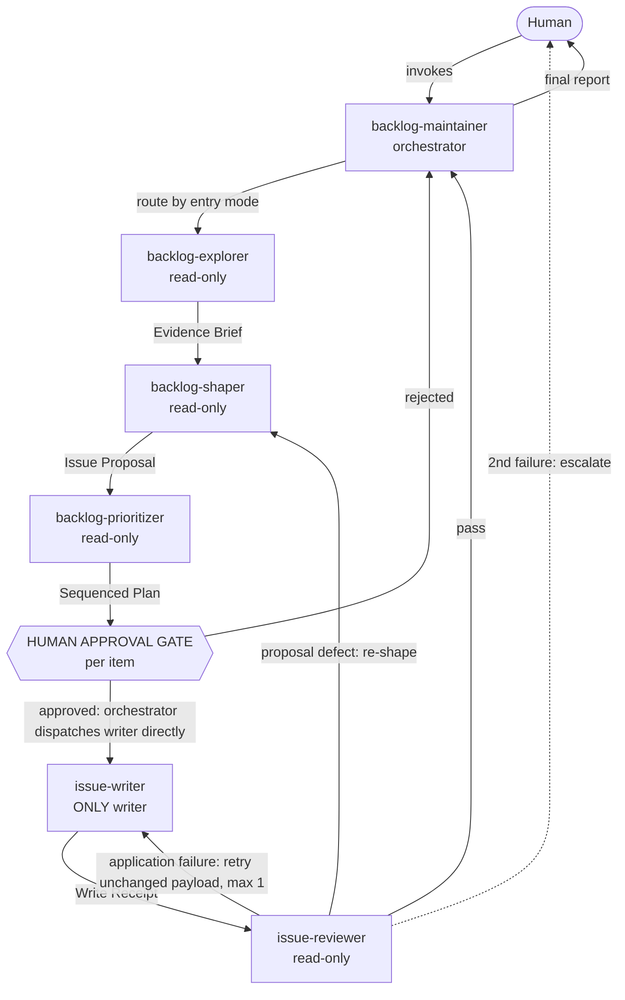

# Backlog Maintainer Agent System — Design

Design for the **product-owner side** of the agent workflow: a user-invocable
orchestrator that owns the backlog lifecycle, delegates every phase — including the
approved write — to focused subagents, and holds the human approval gate at the point of
write rather than at the point of dispatch. This document is the design of record; the
`.agent.md` files and the GitHub issues that track their creation derive from it.

Sibling systems (build/ship, articles) reuse the same structural pattern and are
designed separately.

## Platform capabilities this design relies on

Verified against the official custom-agent configuration reference and the Copilot CLI
and VS Code agent docs. These are the load-bearing facts; if any changes, revisit the
design.

| Capability | Status | Design consequence |
| --- | --- | --- |
| `agent` tool alias (aliases: `Task`, `custom-agent`) lets an agent dispatch another custom agent as a subagent | Supported on **Copilot CLI** and **VS Code** | The orchestrator can genuinely delegate every phase, including the gated write, once approval has happened. |
| Subagents run with their **own isolated context window** | Supported | Each phase gets a clean context; the orchestrator's context stays small and is not polluted by raw research. |
| `tools:` **filters** the tool set actually exposed to the agent (omit = all, `[]` = none, list = only those) | Enforced, not advisory | "Only one agent may write to GitHub" is a real, enforceable boundary — not a convention. |
| `disable-model-invocation: true` prevents the model from auto-selecting an agent as a subagent | Supported | No longer used on `issue-writer` (see "Human approval gate" below) — the gate is now enforced by `issue-writer`'s own proof-of-approval check instead. |
| `user-invocable: false` hides an agent from the picker | Supported | Deliberately **not** used here — see "Surface portability". |
| VS Code-only `agents:` list restricts which subagents a coordinator may dispatch, and **overrides** `disable-model-invocation` for that coordinator | VS Code only | No longer a footgun to avoid: `issue-writer` is now deliberately included in the orchestrator's `agents:` list on every surface, and no longer carries `disable-model-invocation`, so there is nothing left to override. |
| VS Code-only `handoffs:` list offers user-controlled transitions between agents | VS Code only | No longer the primary write mechanism — superseded by direct orchestrator dispatch (below) — but still available as a manual fallback if Logan wants to trigger the write himself. |
| Subagent dispatch is **not** supported on plain github.com chat with no session tooling | Not supported | The cycle must degrade to manual sequential invocation only on that surface (see "Surface portability"). |
| The **Copilot App** (this repo's session-based workspace tooling: `create_session`, `get_session`, `send_session_message`) lets a running session spawn other **tracked, sidebar-visible child sessions** | Supported for spawning and observing | Each phase becomes an inspectable, named session Logan can watch. **However, child sessions may be granted fewer tools than their frontmatter declares — including no `github/*` tools and no messaging tool — and `send_session_message` delivery from root to child has proven unreliable.** The design therefore treats the child's **final reply message as the artifact** and has the orchestrator **pull** it from the child's transcript via `session_store_sql` (source `local`) once `get_session` shows the child complete. It is a stronger, observable delegation mechanism than the in-process `agent` tool; the orchestrator prefers it over `agent` whenever available. |
| Configured GitHub read tools provide the live backlog read | Required preflight | Every backlog phase that needs live GitHub state must prove this capability before reading or writing; a local file check is not sufficient. Exact tool names are namespaced per-surface — see "GitHub MCP configuration surface" — but an agent may only recover to an equivalent name that is already exposed through its own `tools:` allowlist; a genuine rename still requires a human frontmatter update. |
| Skills are description-triggered and shared by all agents; there is no `skills:` frontmatter field | Confirmed | Agents reference `shape-backlog-idea` in their prose body; the skill stays the single source of backlog judgment. |
| Subagent invocations are **stateless** — no follow-up messages to a running subagent | Confirmed | All context must be passed in the initial delegation, which forces explicit artifact hand-offs (below). Tracked Copilot App child sessions may be **messaging-less** (no `send_session_message` and no reliable delivery to root), so even there the design does not rely on follow-up pushes: the orchestrator embeds everything the child needs in the kickoff prompt, and the child's terminal reply **is** the artifact, retrieved by pull. This keeps the two dispatch mechanisms interchangeable. |

## GitHub MCP configuration surface

This repository already has the supported VS Code workspace configuration in
[`.vscode/mcp.json`](../../.vscode/mcp.json), where the remote server is named `github`
and uses GitHub's OAuth-capable hosted endpoint. Do not add a token or duplicate this
server in another checked-in MCP file. VS Code forwards this workspace configuration to
the Agent Host when enabled; Copilot CLI instead reads its own, **not checked into this
repo**, `~/.copilot/mcp-config.json` for the `github` server definition. Copilot cloud
agent also provides its `github` server as an out-of-the-box capability, configured in
repository settings rather than a committed `.mcp.json`.

**Correction from an earlier version of this design:** Copilot CLI is *not* guaranteed
read-only by default — whether the CLI's `github` server exposes write tools depends
entirely on the user's own `~/.copilot/mcp-config.json` (e.g. a `"tools": ["*"]` entry
exposes everything, reads and writes alike). The system does **not** rely on the MCP
server being read-only; the real enforcement is each agent's own `tools:` frontmatter
allow-list, which VS Code and Copilot CLI both apply regardless of what the underlying
server offers. A user could optionally scope their CLI config to read-only tools as
defense in depth, but it is not load-bearing for this design.

The agent frontmatter uses the current GitHub MCP tool names, namespaced as
`github/<tool>`. In particular, issue reads and writes are the combined
`github/issue_read` and `github/issue_write` tools, and pull request reads use
`github/pull_request_read`; obsolete names such as `github/get_issue`,
`github/create_issue`, and `github/list_milestones` must not be added back.

### If a tool name does not resolve ("tool not available")

The most common cause of an agent reporting a GitHub tool as missing is not a wrong tool
name in this repo's frontmatter — it is that **the surface running the agent has no
`github` MCP server configured at all**, or has it configured under toolsets that omit
issues/pull requests. Before assuming a tool name is wrong, check:

| Surface | Where the `github` server is configured | What to verify |
| --- | --- | --- |
| **VS Code** | `.vscode/mcp.json` (committed, shared) | Server named exactly `github`; Agent Host / remote MCP enabled in VS Code settings. |
| **Copilot CLI** | `~/.copilot/mcp-config.json` (per-user, not in this repo) | A `github` server entry exists and its `tools` list includes (or `*`s) `issue_read`, `issue_write`, `list_issues`, `search_issues`, `pull_request_read`, `list_pull_requests`, `search_pull_requests`, `add_issue_comment`. |
| **Copilot cloud agent / GitHub Copilot app** | Repository → Settings → Copilot → coding agent MCP configuration | The `github` toolset is enabled for this repository, with `issues` and `pull_requests` included. |

If the server is present but a specific literal tool name in an agent's frontmatter still
does not resolve, the agent may only check its actual available tool list for a
same-purpose tool that was already granted in that same `tools:` allowlist. Because
`tools:` is enforced, a renamed tool that is not listed in frontmatter is
architecturally invisible to the agent and cannot be self-discovered at runtime. In that
case, the correct diagnosis is configuration drift in this repo's agent file: a human
must update the affected `tools:` frontmatter before the agent can use the renamed tool.

## GitHub read preflight and blocked state

Live GitHub state is a prerequisite for every backlog workflow. Before the maintainer
classifies or dispatches, and before any phase independently reads live backlog state, the
agent MUST call the configured `github/list_issues` read tool for owner `lfarci`,
repository `loganfarci.com`, state `open`, with the smallest limit accepted by that
connector. The repository does not document the connector schema, so agents MUST use only
parameters exposed by the tool and omit the limit if it is unsupported. A successful
GitHub response — including an empty result — is the only valid preflight.

**Orchestrator-supplied snapshot relief.** Because tracked child sessions may be granted
fewer tools than their frontmatter declares, the orchestrator performs its own live
preflight (a capability check only, using the smallest accepted limit) and then makes a
**separate, complete fetch** of the GitHub state each phase actually needs — the full open
issue list at the largest accepted page size, plus closed issues and/or pull requests when
the phase must check for duplicates or already-completed work. The orchestrator embeds
that complete, phase-specific result as a **fresh, verbatim snapshot** in each child's
kickoff prompt, explicitly labelled as live and complete. A subagent that receives such a
snapshot MUST treat it as satisfying the preflight — it counts as live state, and the
subagent must not re-query or block. Without a supplied snapshot, the preflight is
mandatory and no fallback is permitted.

The preflight is a capability check, not a local repository check. If the tool is
unavailable or the call fails, the agent MUST stop and return a blocked report with:

- `status: blocked`
- `tool_attempted: github/list_issues` and the intended owner, repository, state, and
  limit (when supported)
- `exact_error: <verbatim connector error>`
- `workflow: blocked; no live GitHub state was established`

The blocked report MUST NOT be converted into an Evidence Brief, Issue Proposal,
Sequenced Plan, Write Receipt, or Review Verdict, and MUST NOT be passed to the next
phase. There is no fallback: agents MUST NOT use `gh`, `web`, a local/stale snapshot,
prior conversation, or inferred issue state to continue. The maintainer MUST stop before
classification and subagent dispatch. The explorer, prioritizer, reviewer, and writer
MUST stop their respective work; the shaper MUST propagate a blocked input without
shaping it, and MUST run this preflight first if it independently needs live GitHub reads.
When the failure is a literal-name miss and no already-granted alias resolves, the
blocked explanation SHOULD say that the affected agent's `tools:` frontmatter needs a
human update on this repo or surface.

## Design principles

1. **The orchestrator is the product owner, not a worker.** It decides *what phase runs
   next* and is accountable for the outcome. It performs no research, writes no issue
   prose, and holds no write tools.
2. **Privilege is concentrated and minimal.** Exactly one agent can write to GitHub, and
   it is deliberately the *least* intelligent step in the cycle: it executes an already
   approved payload rather than deciding content. Minimizing what the privileged agent
   decides is the point.
3. **Every hand-off is an explicit artifact.** Because subagents are stateless and
   context-isolated, phases communicate through defined structures (below), not shared
   memory. This also makes the cycle debuggable and resumable.
4. **Judgment lives in the skill, not duplicated across agents.** `shape-backlog-idea`
   remains the single source of truth for investigation depth, backlog-action choice,
   issue structure, and prioritization order. Agents reference it; they do not restate it.
5. **The human gate is enforced at the point of write, not by blocking dispatch.**
   Approval before any GitHub write is enforced by requiring Logan's explicit per-item
   sign-off *and* by `issue-writer` refusing to act without proof that sign-off happened —
   not by preventing the orchestrator from dispatching `issue-writer` at all. This is a
   deliberate change from the original structural block (`disable-model-invocation` plus
   omission from `agents:`), which also made every write require a manual agent switch.
   The gate still cannot be rationalized past silently: `issue-writer` checks for approval
   proof itself, so a dispatch without it is refused at the writer, not merely discouraged
   in prose.
6. **Degrade gracefully.** The same agents must be runnable one-by-one by a human on a
   surface without delegation.

## The agents

Six agents: one orchestrator, five subagents.

### 1. `backlog-maintainer` — orchestrator (the product owner)

| Aspect | Definition |
| --- | --- |
| **Invoked by** | The human. This is the entry point of the system. |
| **Owns** | Routing the request to the right cycle, sequencing phases, holding the human gate, and producing the final report. |
| **Reads before acting** | `docs/specs/README.md` (for spec precedence), `docs/specs/non-goals.md`, `AGENTS.md`, `.github/copilot-instructions.md`. |
| **Tools** | `agent` (delegation), `create_session`/`get_session`/`send_session_message` (tracked-session delegation on the Copilot App), `session_store_sql` (pull child artifacts from their transcripts), `read`, `search`, plus GitHub **read-only**. |
| **Must NOT have** | Any GitHub write tool, `edit`, or `execute`. It must be incapable of mutating the backlog or the repo directly — it only ever reaches a write by dispatching `issue-writer`. |
| **Produces** | A phase-by-phase status and a final report: what was found, what was decided, what was written (with links), what was escalated. |
| **`agents:` list** | `backlog-explorer`, `backlog-shaper`, `backlog-prioritizer`, `issue-writer`, `issue-reviewer` — **includes `issue-writer`**, dispatched only in the same turn as, and strictly after, Logan's per-item approval (see "Human approval gate"). |
| **On failure** | If any phase reports a blocking condition, stop and report. Never skip a phase to reach a write. |

**Routing responsibility.** The orchestrator first classifies the request into one of four
entry modes, because the phase sequence differs per mode:

| Entry mode | Trigger | Phase sequence |
| --- | --- | --- |
| **Idea intake** | Logan describes one idea, defect, or observation (often voice-dictated) | explore (targeted) → shape → gate → write → review |
| **Backlog sweep** | "What's missing?" — specs/code vs. the live backlog | explore (sweep) → shape (per candidate) → prioritize → gate → write → review |
| **Prioritization** | "What should I work on next?" | explore (light) → prioritize → report (no write) |
| **Grooming/hygiene** | Stale, duplicate, or completed items; milestone cleanup | explore (sweep) → shape (close/merge recommendations) → gate → write → review |

### 2. `backlog-explorer` — evidence gathering (read-only)

| Aspect | Definition |
| --- | --- |
| **Owns** | Establishing facts. What does the code actually do, what do the specs require, what already exists in the backlog. |
| **Two modes** | **Targeted** — investigate one idea (resolve vague nouns against real UI/code, find related open/closed issues and PRs, check git history). **Sweep** — diff `docs/specs/` and the current code against the whole backlog to surface gaps, drift, duplicates, and stale items. |
| **Reads** | `docs/specs/`, the codebase, open and recently-closed issues, related PRs, git history. |
| **Tools** | `read`, `search`, `web`, GitHub **read-only** (issue list/view/search). |
| **Must NOT have** | Any GitHub write tool, `edit`. |
| **Produces** | An **Evidence Brief** (contract below). Facts and citations only. |
| **Explicitly does not** | Decide whether something belongs in the backlog, or draft issue prose. It reports; it does not judge. |
| **On failure** | If it finds no actionable gap, it says so plainly. The cycle stops there — the system must never manufacture work to look productive. |

### 3. `backlog-shaper` — judgment and drafting (read-only)

| Aspect | Definition |
| --- | --- |
| **Owns** | Turning evidence into a decision and a ready-to-post issue draft. This is where product judgment happens. |
| **Reads** | The Evidence Brief, the `shape-backlog-idea` skill, `docs/specs/non-goals.md` and `vision.md` (scope check), the relevant specs. |
| **Tools** | `read`, `search`, `web`, GitHub **read-only**. |
| **Must NOT have** | Any GitHub write tool. It drafts; it never posts. |
| **Produces** | An **Issue Proposal** (contract below) — including the explicit recommendation to create, update, close, defer, or **do nothing**. |
| **Key responsibility** | Declining. Per `shape-backlog-idea`, it must be willing to recommend *not* filing an issue when the work already exists, is out of scope per non-goals, or has no meaningful outcome. |
| **On failure** | If the outcome is clear but the design is not, it emits 2–3 credible options with a preferred starting point rather than inventing certainty. |

### Human approval gate

Between shaping and writing. **Hard, non-optional — enforced by explicit human sign-off
plus `issue-writer`'s own proof-of-approval check, not by a structural invocation block.**

- The orchestrator presents each Issue Proposal with the exact repository, action
  (create/update/close), title, type label, milestone, and assignee — matching the rule
  `shape-backlog-idea` already imposes on manual use.
- The human approves, edits, or rejects **per item**.
- **Any change to proposal content re-enters this gate.** Approval covers a specific payload,
  not an item in general, so a re-shaped proposal is a new proposal and needs fresh approval.
- Enforcement changed from v0.2.0: `issue-writer` no longer carries
  `disable-model-invocation`, and is now included in the orchestrator's `agents:` list on
  every surface. This trade was made deliberately, because the old flag also made it
  impossible for the orchestrator to invoke the writer *automatically after* a real
  approval, forcing Logan to manually switch agents every time — the exact friction that
  prompted this revision. The compensating control moved into `issue-writer` itself: it
  refuses to write unless its input carries explicit proof that Logan approved this exact
  payload (a quote or unambiguous restatement of his approval), so an orchestrator that
  tried to dispatch it without a real approval would be refused by the writer, not merely
  by convention.
- After approval, the orchestrator dispatches `issue-writer` itself in the same turn,
  passing the approved payload plus the approval proof. On the Copilot App surface this
  dispatch is a tracked child session (`create_session`, `kickoff.agent: "Issue Writer"`)
  so Logan can watch it run; on CLI/VS Code it is the in-process `agent` subagent call.
  Logan can still invoke `issue-writer` manually himself at any time (it stays
  `user-invocable: true`) — the orchestrator's automatic dispatch is an addition, not a
  replacement for that.
- Explore, shape, and prioritize need **no** gate — they are read-only, reversible, and
  cheap to re-run.

### 4. `issue-writer` — the only write-capable agent

| Aspect | Definition |
| --- | --- |
| **Owns** | Executing an approved Issue Proposal against GitHub. Nothing else. |
| **Reads** | The approved Issue Proposal, and the target issue if updating. |
| **Tools** | GitHub **write** (create issue, update issue, comment, label, milestone) plus GitHub read. |
| **Must NOT have** | `edit`, `execute`, or `agent`. It must not be able to modify the repository or delegate onward. |
| **Deliberately constrained** | It does **not** re-investigate, re-decide, or improve the draft. If the proposal seems wrong, it stops and reports rather than "fixing" it. Content authority stays with the shaper and the human. It also refuses to act on any input that lacks explicit proof of Logan's per-item approval — see "Human approval gate" above. |
| **Produces** | A **Write Receipt** (contract below): issue number, URL, action taken, and the fields actually set. |
| **Granularity** | One approved proposal per invocation, so a rejection or failure never cascades across items. |
| **On failure** | Reports the failure and stops for that item. Never retries a write silently. |

### 5. `issue-reviewer` — post-write consistency audit (read-only)

| Aspect | Definition |
| --- | --- |
| **Owns** | Verifying that what landed on GitHub matches what was approved and meets repository conventions. |
| **Checks** | **Drift** — does the posted issue match the approved proposal? **Structure** — required sections present, correct type label, sane milestone. **Duplication** — no now-redundant issue left open. **Links** — specs and related issues referenced. |
| **Reads** | The Write Receipt, the posted issue, the approved proposal, sibling issues, `shape-backlog-idea`. |
| **Tools** | `read`, `search`, GitHub **read-only**. |
| **Must NOT have** | Any write tool. It flags; it never edits. Keeping the auditor unable to write preserves the single-writer property. |
| **Produces** | A **Review Verdict**: pass, or fail with specific, actionable findings, each classified as an *application failure* or a *proposal defect* (below). |
| **On fail** | Routed by failure class. An **application failure** goes straight back to `issue-writer` with the unchanged approved payload, **bounded to one retry**. A **proposal defect** goes back to `backlog-shaper` and through the approval gate again, because fixing it changes approved content. Either way a second failure escalates to the human, which prevents an unbounded loop. |

### 6. `backlog-prioritizer` — sequencing (read-only)

| Aspect | Definition |
| --- | --- |
| **Owns** | Ordering work and surfacing dependencies. |
| **Reads** | Issue Proposals and/or the live backlog, the "Prioritize and sequence" rules in `shape-backlog-idea`, current milestones and assignees. |
| **Tools** | `read`, `search`, GitHub **read-only**. |
| **Must NOT have** | Any write tool. Notably it must not set milestones or labels — sequencing is advice until the human accepts it. |
| **Produces** | A **Sequenced Plan**: ordered items, rationale per position, and explicit "X before Y" dependencies. |
| **On ambiguity** | Flags genuinely ambiguous orderings for a human decision instead of guessing, and never presents inferred priority as confirmed GitHub Project state. |

## Tool permission matrix

The single most important property of this system: **exactly one row has write access.**

| Agent | `agent` | `read` / `search` | `web` | `edit` / `execute` | GitHub read | GitHub **write** |
| --- | :---: | :---: | :---: | :---: | :---: | :---: |
| `backlog-maintainer` | ✅ | ✅ | — | ❌ | ✅ | ❌ |
| `backlog-explorer` | ❌ | ✅ | ✅ | ❌ | ✅ | ❌ |
| `backlog-shaper` | ❌ | ✅ | ✅ | ❌ | ✅ | ❌ |
| `backlog-prioritizer` | ❌ | ✅ | — | ❌ | ✅ | ❌ |
| `issue-writer` | ❌ | ✅ | — | ❌ | ✅ | ✅ |
| `issue-reviewer` | ❌ | ✅ | — | ❌ | ✅ | ❌ |

No agent in this system has `edit` or `execute`: backlog maintenance never modifies the
repository. That is the build system's job (sibling design), and keeping the boundary
sharp prevents this system from quietly becoming a code-change path.

## Interaction flow

Notes on the flow:

- **Prioritization is optional per entry mode.** A single idea intake skips it; a sweep
  and a prioritization request require it.
- **The write/review loop runs per item**, not per batch, so one bad item cannot block or
  corrupt the rest.
- **The writer hop is orchestrator-dispatched, not user-triggered.** Immediately after
  Logan's per-item approval, `backlog-maintainer` dispatches `issue-writer` itself — as an
  in-process subagent on CLI/VS Code, or as a tracked child session on the Copilot App —
  passing the approved payload plus proof of Logan's approval. `issue-writer` checks for
  that proof before writing anything. The receipt returns to the orchestrator before
  review continues. Logan can still invoke `issue-writer` manually if he prefers.
- **Child artifacts are retrieved by pull, not delivered by push.** Tracked child sessions
  return their artifact as their **final reply message**, which the orchestrator pulls
  from the child's transcript (`session_store_sql`, source `local`, `turns` table, most
  recent `assistant_response`) after `get_session` reports it complete. The orchestrator
  embeds a fresh live GitHub snapshot and all context in the kickoff prompt up front,
  ships the artifact from one phase into the next phase's kickoff prompt, and does not rely
  on `send_session_message` for delivery — a single nudge may be attempted if a child goes
  silent, but if no artifact is retrievable the orchestrator escalates to Logan with the
  child's partial transcript.
- **Review failures are routed by class, not lumped together.** An *application failure*
  means the approved payload did not land correctly — a transient API error, a field that
  did not take, a partial write. The approved content is still valid, so the writer may be
  re-invoked with the **unchanged** payload. A *proposal defect* means the approved content
  itself was wrong — a bad milestone, a missing spec link, a duplicate that should have been
  an update. Repairing that changes what was approved, so it must go back to the shaper and
  through the gate again. Letting the writer "fix" a proposal defect would both break its
  no-re-deciding constraint and silently bypass human approval.
- **The orchestrator never touches GitHub state**; it only ever reports and routes.

## Artifact contracts

Because subagent invocations are stateless and context-isolated, every hand-off must be
fully self-contained. These shapes are the interface between phases and should be
specified once in the shared skill so independently-invoked agents agree on them.
Delivery is **pull-based**: when a subagent runs as a tracked child session, its final
reply message is the artifact and the orchestrator retrieves it via `session_store_sql`
(snapshot-through transcript read); when it runs in-process, the returned text is the
artifact. Subagents never deliver artifacts with a messaging tool.

**Evidence Brief** (explorer → shaper)
- `subject` — the idea, gap, or issue under investigation
- `current_behavior` — what the code/site actually does today, with file or route citations
- `spec_position` — what the relevant specs require, with links
- `existing_backlog` — related open/closed issues and PRs, with numbers
- `findings[]` — each with evidence and a *suggested* action type (not a decision)
- `unknowns` — anything that could not be verified, explicitly labelled as such

**Blocked report** (terminal preflight failure)
- `status: blocked`
- `tool_attempted` — `github/list_issues`, with the intended owner, repository, state,
  and smallest supported limit
- `exact_error` — the connector error verbatim
- `workflow` — `blocked; no live GitHub state was established`

This is a terminal status for the current workflow, not an Evidence Brief. It MUST NOT be
passed to the next phase or converted into any other artifact contract. When a subagent is
dispatched as a tracked child session, a blocked report is returned the same way as any
other artifact — as the child's final reply message, pulled by the orchestrator — so the
orchestrator can distinguish a blocked child from a silent one.

**Issue Proposal** (shaper → gate → writer)
- `recommendation` — create | update | close | defer | **no-op**, with the decisive tradeoff
- `target` — repository, and issue number when updating
- `title`, `body` — the exact final text to post
- `type_label`, `milestone`, `assignee` — the exact metadata to set
- `options[]` — 2–3 credible approaches with a preferred one, when design is genuinely open
- `scope_check` — confirmation it does not cross `non-goals.md`
- `verification` — how the resulting work would be proven done

**Sequenced Plan** (prioritizer → gate)
- `ordered_items[]` — with position rationale
- `dependencies[]` — explicit "X before Y"
- `ambiguous[]` — orderings requiring a human decision

**Write Receipt** (writer → reviewer)
- `action_taken`, `issue_number`, `issue_url`, `fields_set`, `proposal_ref`

**Review Verdict** (reviewer → orchestrator)
- `result` — pass | fail
- `failure_class` — `application` (approved payload did not land) | `proposal` (approved
  content itself is wrong), when failed. Determines whether the fix routes to the writer or
  back through the shaper and gate.
- `findings[]` — specific and actionable, when failed
- `retry_count`

## Surface portability

| Surface | Behavior |
| --- | --- |
| **Copilot CLI** | Full delegation end-to-end, including the write. `backlog-maintainer` dispatches every phase — `backlog-explorer`, `backlog-shaper`, `backlog-prioritizer`, and, immediately after Logan's per-item approval, `issue-writer` — via the in-process `agent` tool, then `issue-reviewer`. Logan can still invoke any subagent manually if he wants to intervene mid-cycle. |
| **VS Code** | Same full delegation as CLI. `issue-writer` is now included in the orchestrator's `agents:` list (previously omitted); a `handoffs:` transition to `issue-writer` remains available as a manual alternative for Logan, but is no longer the only path. |
| **Copilot App (this repo's session-based workspace)** | Full delegation, dispatched as **tracked child sessions** rather than in-process subagent calls: `backlog-maintainer` calls `create_session` with `kickoff.agent` set to each phase's exact custom-agent name, including `Issue Writer` right after approval. Logan sees every phase as its own named session in the sidebar and can inspect it directly. **Because children may lack `github/*` tools and messaging, the orchestrator embeds a fresh live GitHub snapshot (its own verified preflight output) in every kickoff prompt, and retrieves each phase's artifact from the child's transcript (`session_store_sql`, source `local`) after the child completes — pull, not push.** `get_session` is used to poll for completion; `send_session_message` is used only as a single nudge when a child goes silent, and is never assumed to deliver artifacts. This is the surface where delegation is most observable, which is why it is preferred whenever those tools are present. |
| **Plain github.com chat / any surface with no subagent-dispatch tool at all** | No subagent dispatch. The cycle degrades to the human invoking each agent in order via `/agent`, passing the artifact from the previous phase. This is now the rare exception, not the default path for the App. |

To keep that degradation possible, **every subagent stays `user-invocable: true`.** The
cycle must be runnable by hand; delegation is an accelerant, not a dependency.

## Relationship to the `shape-backlog-idea` skill

The skill stays the single source of backlog judgment — investigation depth, choosing the
backlog action, issue structure, prioritization order, and the "state the write before
making it" rule. Agents reference it rather than restating it, so there is one place to
change the rules. Its preparation rules also carry the GitHub read preflight and the
no-fallback requirement; the blocked-state artifact above remains the system-level
hand-off contract.

One addition is needed: an **artifact hand-off section** documenting the contracts above,
so agents invoked independently still produce and consume compatible shapes.

## Open questions

1. **Explorer/shaper split.** Separating evidence from judgment is clean and keeps each
   context small, but costs one extra hop for simple ideas. Alternative: merge them and
   let the orchestrator skip shaping for trivial cases. Recommend starting split, and
   merging only if the extra hop proves to be pure overhead in practice.
2. **Whether `issue-writer` should also handle closing issues,** or whether closing (a
   destructive action) deserves its own even-more-restricted agent. Recommend one writer
   initially, with closure always requiring explicit per-item human approval.
3. **Named dispatch.** The CLI documents hinting a specific agent by `@name` in a prompt,
   but there is no structured frontmatter field to force a specific subagent. The
   orchestrator's prose must name subagents explicitly and unambiguously.
4. **How much to let Copilot App sessions collaborate.** `send_session_message` lets a
   tracked child session message another sibling session directly, not just report back
   to the orchestrator. This design intentionally keeps the pipeline strictly linear
   (each phase reports to the orchestrator, which dispatches the next) rather than letting
   e.g. `issue-reviewer` message `issue-writer` directly, so failure routing stays
   auditable through the orchestrator's Step 5 logic.
   **Resolved (v0.3.x, pull-based handoff):** child sessions cannot be assumed to carry
   `github/*` tools, a messaging tool, or a working `send_session_message` delivery path.
   The design therefore does not rely on session-to-session messaging at all: the
   orchestrator embeds a fresh live GitHub snapshot plus all phase context in each kickoff
   prompt, children return the artifact as their final reply, and the orchestrator pulls
   it from the child's transcript via `session_store_sql`. Sibling messaging remains out of
   scope; revisit only if a concrete case shows the orchestrator hop adds real latency
   without adding safety.
