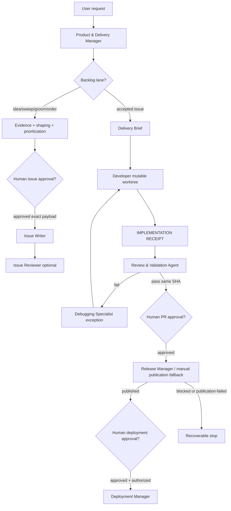

# Product & Delivery Manager - Design

This is the design of record for the recommended agent-system architecture: **one
Product & Delivery Manager + Developer + Review & Validation Agent**, with separate
Issue Writer and Release/Deployment gates. It replaces the former split backlog and delivery designs while keeping their security
boundaries.

## Active role set

The active system contains the **Product & Delivery Manager**, focused backlog helpers,
the **Developer**, one **Review & Validation Agent**, Issue Writer, Issue Reviewer, and
separate Release/Deployment roles. Deprecated compatibility routers and legacy split
review/test/QA agents have been removed. This change is orchestration
documentation/configuration only and does not broaden write, publication, deployment,
or product-code permissions.

## Capability baseline

| Capability | Status and safe use |
| --- | --- |
| Custom-agent frontmatter | Use only documented `name`, `description`, `tools`, `agents`, and `user-invocable` fields. A missing tool is a blocker, not a reason to grant wildcard tools. |
| Copilot App child sessions | `create_session`, `get_session`, `list_sessions_and_chats`, `send_session_message`, and `session_store_sql` were observed. Child final replies are terminal artifacts only when a verified retrieval surface preserves the full response and provenance. `send_session_message` is one nudge and never transports or substitutes for an artifact. |
| Trusted child startup `HEAD` metadata | Not structurally guaranteed. Automated handoff requires host-provided `initial_head` before work. A read-only child may echo it but must not claim command-derived evidence. If absent, use the manual snapshot fallback. |
| Branch-based child creation | `create_session` accepts `base_branch`, not arbitrary SHAs. A receipt branch may be used only when the host accepts it and returns distinct child branch/worktree identity plus trusted startup metadata equal to the receipt SHA. |
| Terminal artifact retrieval | A child identity, branch, diff, SHA, or commit is not a receipt. If a complete terminal artifact with provenance is unavailable or ambiguous, record `blocked` with reason `artifact-unavailable`, preserve the last trusted receipt, and stop. |
| GitHub access | Product & Delivery Manager has no GitHub tools and must not fabricate backlog state. Backlog helpers and Issue Writer/Reviewer own their `github/*` preflight; if unavailable, they return blocked. Issue Writer remains the only backlog writer. Release publication is blocked/manual until a verified exact write mechanism is allowlisted. |
| Execution | Product & Delivery Manager has no `execute`. Developer and Review & Validation use execution only as a behavioral boundary: no credentials, no `git push`, no `gh`, no deployment, no Azure/SWA/Terraform apply unless inside the separately approved role. |

## Two lanes

### Backlog lane

The Product & Delivery Manager owns intake, evidence sequencing, issue shaping,
prioritization, and the human gate before any GitHub issue write. It may dispatch
`backlog-explorer`, `backlog-shaper`, and `backlog-prioritizer` for focused read-only
work, or use their existing contracts as compatibility helpers. Helper agents establish
live GitHub state themselves through their documented preflight; if their runtime has no
working GitHub read surface, their blocked report stops the phase. The manager records
that state instead of fabricating or supplying a live snapshot. It presents each Issue
Proposal exactly and waits for explicit per-item approval before dispatching
`issue-writer`. Approval covers one exact payload; edits re-enter the gate. No other
role writes backlog state. `issue-reviewer` may be retained as a read-only post-write
audit.

### Delivery lane

For an accepted issue, the Product & Delivery Manager creates a Delivery Brief,
selects applicable repository instructions/specs and optional specialists by path/risk
trigger, creates one Developer session, then validates the committed Implementation
Receipt through one `feature-review-validation` phase. Green same-SHA evidence is
required before a PR approval proposal. PR approval never authorizes deployment.
Release and Deployment remain separate approval-gated roles.

## Role matrix

| Role | Owns | Tools/boundary | Must not do |
| --- | --- | --- | --- |
| Product & Delivery Manager | Backlog intake, evidence routing, issue shaping/prioritization orchestration, Delivery Briefs, sequencing, gates, artifact/provenance ledger | Read/search and session coordination only; no GitHub tools | Edit, execute, write GitHub issues directly, publish, deploy, merge, or self-accept |
| Issue Writer | Execute exactly one approved Issue Proposal | Only role with backlog GitHub write permission; proof-of-approval gate unchanged | Decide, rewrite, batch, investigate, execute shell commands, or write without approval proof |
| Issue Reviewer | Optional post-write audit | Read-only | Edit or repair GitHub state |
| Developer | Implement one accepted Delivery Brief in one mutable worktree | Read/search/edit/execute; must commit before handoff | Publish, deploy, change scope, waive findings, or use credentials |
| Review & Validation Agent | Independent diff/spec review plus targeted deterministic checks and QA for one receipt SHA | Read/search/execute; no edit/write tools | Edit, publish, deploy, self-accept, downgrade failures, or change scope |
| Release Manager | Publication preflight and PR proposal/receipt for one approved SHA | Currently blocked/manual fallback; future writes require verified minimal allowlist | Edit, merge, deploy, substitute refs/payload, or treat local commit/failed PR as publication |
| Deployment Manager | Deploy one separately approved published SHA to one named environment/mechanism | Execute only after independent approval and authorization checks | Edit, create PRs, merge, substitute target/SHA/mechanism, inject credentials |
| Debugging Specialist | Exception-only diagnosis of reproducible Review & Validation failures | Read/search/execute evidence only | Edit, publish, deploy, or choose a scope-changing fix |
| Orchestration Maintainer | Exception-only fix for confirmed critical delivery-system incidents | Orchestration docs/config/fixtures only, commit-bound Remediation Receipt | Product/source changes, permission broadening, publishing, deploying, or silent policy changes |
| Domain specialists | Optional advisory guidance selected by path/risk triggers | Read-only advisory unless their agent file states stricter limits | Mandatory pipeline work, scope decisions, publication, or deployment |

Path/risk triggers select specialists only when relevant: React/SSR, UI/layout,
WCAG, `.github/workflows/**`, `infra/**`, Static Web Apps/deployment configuration,
secrets/permissions/dependencies/input handling, or another documented risk.

## Artifact and approval boundaries

Every artifact includes `delivery_id`, issue number/URL when applicable, source branch,
source commit SHA, input references, status, timestamp, session ID, retrieval surface,
and provenance.

| Artifact | Boundary |
| --- | --- |
| Evidence Brief / Issue Proposal / Sequenced Plan | Backlog evidence and judgment; never a write. |
| Approval Record | Exact action, target repository/environment, branch/SHA, payload/mechanism, invalidation rules, and verbatim human approval quote or unambiguous approval-message reference. |
| Delivery Brief | Accepted issue, objective, constraints, in/out scope, base branch/SHA, selected/excluded instructions, specialist triggers, required checks, release/deployment intent. |
| Startup ACK | Child readiness signal only. It records session/worktree/branch and trusted `initial_head`; it is not a terminal receipt and never advances a gate by itself. |
| `IMPLEMENTATION RECEIPT` | Developer's final committed handoff. It must use this exact heading and include changed paths, branch/ref, exact SHA, parent/base SHA, startup `HEAD`, commands/results, limits, session ID, retrieval surface, provenance, and status. |
| `REVIEW & VALIDATION RECEIPT` | Combined terminal evidence from independent review, deterministic checks, targeted QA, commands/results, findings, unavailable checks, source SHA, retrieval surface, provenance, and status. |
| Release Proposal/Receipt | Approval Record reference, one SHA, approved repository/base/head/title/body, local and remote ref evidence, push exact source ref, remote SHA verification, PR create/update outcome, and resulting PR URL/status or durable failure. |
| Deployment Proposal/Receipt | Approval Record reference, one SHA, published Release Receipt reference, approved environment/mechanism, authorization evidence, execution evidence, URL/status, or durable failure. Deployment requires a published release receipt. |

A local commit is never treated as publication. Publication requires push exact source
ref, remote SHA verification, then PR create/update, in that order. If any step fails,
record `publication-failed` with the verbatim error, remote-ref evidence, attempt
number, preserved Implementation Receipt, and one recovery action.

## Receipt protocol and handoff rules

1. The manager creates one Developer child for the accepted Delivery Brief. Before
   editing, Developer emits a Startup ACK; the manager records equality with the Brief
   base SHA or blocks for manual branch-at-SHA recovery.
2. Developer commits and returns a final `IMPLEMENTATION RECEIPT`. Uncommitted files,
   branch names, diffs, SHAs, and messages are not receipts.
3. For Review & Validation, the manager reserves `delivery_id:review-validation:source_sha`,
   calls `create_session` once with the receipt branch as `base_branch`,
   `kickoff.agent: feature-review-validation`, and `coordinate_with_creator: true`.
   It immediately calls `get_session` and verifies distinct child branch/worktree
   identity, accepted base branch, startup state, and trusted `initial_head == parent_sha
   == base_sha == source_sha` before the child proceeds.
4. The manager retrieves the terminal artifact through a verified host surface and records
   provenance. If retrieval is unavailable or ambiguous, record `blocked` / `artifact-unavailable`,
   preserve the last trusted receipt, and stop. On retry, revalidate the idempotency key
   and record any previous failure or ambiguous create outcome before creating a numbered
   replacement.
5. Before advancing any gate on a terminal receipt, the manager re-verifies that the
   source branch tip still equals `source_sha`. A moved tip invalidates every Review &
   Validation, Debugging, Release, and Deployment artifact for older SHAs and requires a
   new cycle at the new SHA.
6. The manager alone routes child sessions. Children do not create siblings, replacements,
   releases, or deployments.

## Worktree lifecycle

Each role runs in its own worktree. The following rules keep worktree handoffs
unambiguous.

| Rule | Requirement |
| --- | --- |
| One worktree per role instance | Every child gets its own session, worktree path, and branch. A worktree is never reused for a second phase, a second SHA, or a retry. |
| No shared checkout | A branch checked out in one worktree cannot be checked out in another, so each child must branch from the source ref rather than adopt it. A child that reports the Developer's branch, worktree ID, or worktree path is a failed handoff. |
| Read-only phases stay read-only | Review & Validation and Debugging work in their own worktree at `source_sha` and must not commit, switch branches, reset, stash, or clean. |
| Frozen source branch | After the Implementation Receipt, the Developer must not add commits unless the manager opens a new cycle. Because the manager cannot execute commands, tip evidence must come from the child receipt: each execution-bearing child reports the observed source branch tip, and the manager re-verifies the tip before each gate against `source_sha`. |
| Preserved until publication | The source branch must survive worktree retirement. Retiring a child session removes its worktree only; the manager must never delete or re-point the source branch before publication completes or the delivery is abandoned. |
| Retirement after recording | Once a terminal receipt is recorded with provenance, the manager may retire that child. Retirement never substitutes for a receipt, and a retired session's state is never re-read as new evidence. |
| Deployment checkout | Deployment executes only from a checkout whose verified `HEAD` equals the published, approved SHA. |

## Simplified flow

Any missing tool, failed check, unresolved finding, invalid approval, missing receipt,
missing remote ref, remote SHA mismatch, artifact-unavailable state, or authorization gap
blocks the next gate. The manager reports the next safe role or manual fallback; it never
changes scope to force a green result.

## Post-delivery critical-incident self-improvement

After every delivery reaches a terminal state, the manager reviews the Delivery Brief,
all receipts, release/deployment records, and failure records. A critical orchestration
issue is any defect that can lose an artifact, misidentify a SHA/branch, skip a required
gate, misrepresent publication/deployment, route work to an unauthorized role, or make a
failure unrecoverable.

For a critical incident, the manager records a **Critical Orchestration Incident Record**
with delivery ID, phase, evidence, impact, root-cause hypothesis, confidence, affected
rules/files, and safe recovery. It freezes the affected state, preserves original
receipts, and creates one isolated Orchestration Maintainer session. The maintainer may
change only orchestration guidance/configuration/validation fixtures and returns a
commit-bound **Remediation Receipt**. One incident ID gets one remediation attempt until
a human explicitly requests another. A remediation commit is not publication, deployment,
or acceptance of the original delivery.

## Residual risk and release conditions

Execution-bearing roles still rely on behavioral limits until the host exposes scoped
execution and isolated credentials. Release publication remains blocked/manual until a
human verifies exact live GitHub write names and replaces wildcard access with a minimal
allowlist. Deployment remains blocked until the executing identity and named mechanism
are independently authorized without exposing credentials. These risks are explicit and
do not weaken the human approval gates.
