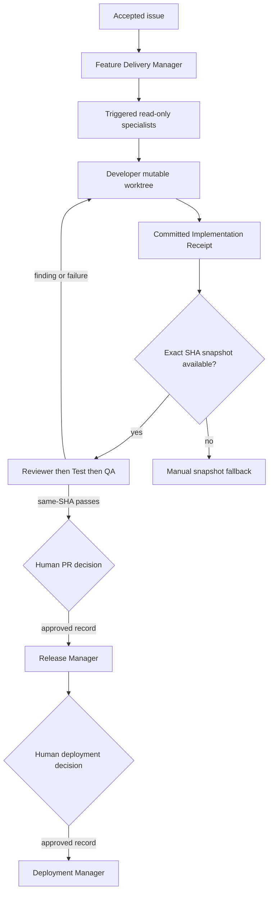

# Feature Delivery Manager - Design

This is the design of record for delivering one already-accepted GitHub issue. It
is intentionally separate from the backlog-maintainer system: the backlog system
decides and approves issue changes; this system implements accepted scope, gathers
evidence, and pauses for human publication and deployment decisions.

Agent files under `.github/agents/` derive from this document. They must reference
the existing skills and specs rather than repeat their guidance.

## Evidence and capability baseline

The table distinguishes a verified capability from a desired one. "Observed" means
it was available in the Copilot App session that created this design on 2026-08-10;
"documented" links to the platform documentation. No row grants a permission by
implication.

| Capability | Status and evidence | Safe use or fallback |
| --- | --- | --- |
| Custom-agent files in `.github/agents/*.agent.md` with `name`, `description`, `tools`, `agents`, and `user-invocable` frontmatter | Documented for VS Code and Copilot cloud agent in [custom-agent configuration](https://code.visualstudio.com/docs/agent-customization/custom-agents) and [GitHub custom agents](https://docs.github.com/en/copilot/how-tos/use-copilot-agents/coding-agent/create-custom-agents). Existing agents use this format. | Use only the documented fields. A missing tool is ignored by the host, so an agent must report a blocker rather than assume a named tool exists. |
| Path instructions under `.github/instructions/*.instructions.md` | Documented by [repository custom instructions](https://docs.github.com/en/copilot/how-tos/configure-custom-instructions-in-your-ide/add-repository-instructions-in-your-ide); existing files use YAML `applyTo`. | `applyTo` accepts comma-separated glob patterns. It is verified for VS Code, Copilot cloud agent, and code review; this task does **not** assert it for the Copilot App session runtime. The App fallback is to attach the selected files to each child prompt and record that in the Delivery Brief. |
| Copilot App tracked child sessions | Observed: `create_session`, `get_session`, `list_sessions_and_chats`, `send_session_message`, and `session_store_sql` are available. | Create a named child with `coordinate_with_creator: true`; its final response is the hand-off artifact. Pull it from the local transcript. A message is a best-effort nudge only, never an artifact transport. |
| Child worktree isolation | Observed: each created local project session is a separate worktree and branch. | The Developer alone owns its mutable worktree. Do not share or check out that live branch in another worktree. |
| Start a child worktree from an exact receipt SHA | **Not verified.** `create_session` accepts an existing `base_branch`, not an arbitrary commit SHA, and the current surface does not expose a branch-at-SHA creation tool. | Do not automate Review, Test, or QA snapshots. Stop with the Implementation Receipt and ask a human to create a distinct branch at that SHA, then start the named phase there. Never substitute a detached checkout or a live Developer branch. |
| Session messages | Observed, but child delivery and child tool inheritance are not guaranteed. | Include all inputs in a kickoff prompt. Retrieve the terminal artifact from the transcript. Use one message only to request a missing artifact. |
| In-process subagents | Documented for VS Code/CLI (`agent` plus an `agents` list); not verified in this App session. | App sessions are the primary route. On a surface without tracked sessions, use a documented in-process subagent only if it can preserve the phase boundary; otherwise stop and name the next manual role. |
| Live GitHub MCP read/write names | **Configuration mismatch.** `.github/mcp.json` configures a `github` server with `tools: ["*"]`, but this session exposes GitHub-oriented built-ins and `gh`, not a discoverable `github/*` MCP toolset. | Do not add `github/*` to new frontmatter. Use no GitHub tools for read-only roles. Release Manager is a human-invocable, approval-refusing placeholder until a human verifies exact PR read/write MCP names and replaces wildcard access with its minimal allowlist. |
| Pull-request write operation | Observed only as the App's `create_pull_request` and `update_pull_request` built-ins, not as a configurable custom-agent tool name. | Do not claim an agent-file allowlist can expose it. A human performs the approved action manually until a verified MCP name is available. |
| Generic command execution | Available on Developer, Test Engineer, QA Engineer, and Deployment Manager target roles; it can run arbitrary Git, GitHub, or deployment commands. No scoped sandbox or isolated credentials was verified. | Boundaries for execution-bearing roles are behavioral, not structural: use isolated worktrees, no credential injection, exact-command logging, and no `git push`, `gh`, `swa deploy`, Azure, or Terraform-apply command outside the approved role and gate. Residual risk remains. |
| Credentials | `gh` is available in the environment, but token scope, Azure/SWA credentials, executing identity, and session credential isolation are unverified. | Never add tokens to files, prompts, or artifacts. Do not attempt credential discovery. Approval is not authorization: deployment remains blocked until a human either performs it in an authorized surface or verifies the executing identity and named mechanism out of band. |

The required GitHub MCP capability is therefore not available for structural
publication enforcement. This blocks only the Release Manager's automated write
configuration; it never authorizes adding `github/*`, broadening execution, or using
shell access as an undocumented replacement.

## Current inventory

| Surface | Current inventory | Delivery use |
| --- | --- | --- |
| Agents | Six backlog agents: `backlog-maintainer`, `backlog-explorer`, `backlog-shaper`, `backlog-prioritizer`, `issue-writer`, and `issue-reviewer` | A separate backlog lifecycle. Do not reuse its GitHub permissions for delivery. |
| Skills | `react-app`, `validate-app`, `run-app-locally`, `triage-accessibility`, `swa-deploy`, `azure-static-web-apps`, `shape-backlog-idea` | Select only when the Delivery Brief's modified paths and risks trigger them. |
| Shared guidance | Root `AGENTS.md`; `src/AGENTS.md`; `content/AGENTS.md`; `.github/copilot-instructions.md`; `docs/specs/`; and the existing article, component, and test instructions | Apply root guidance, then the nearest subtree `AGENTS.md`, selected path instructions, and applicable specs. The Brief records all that apply. |
| Source scopes | `src/src/pages`, `src/src/components`, `src/src/core`, `src/plugins`, `content`, `.github/workflows`, `infra`, and `src/public/staticwebapp.config.json` | The scoped instruction map below maps these paths without a catch-all rule. |
| GitHub configuration | `.github/mcp.json` configures `github` with wildcard `tools: ["*"]`; existing backlog agents also name `github/*`. Neither proves a live named tool in this App session. | Delivery agents do not inherit wildcard permissions or depend on those names. A future verified Release Manager allowlist must replace, never inherit, wildcard access. |

## Roles and boundaries

| Role | Owns | Tools/boundary | Must not do |
| --- | --- | --- | --- |
| Feature Delivery Manager | Route accepted scope, select specialists and instructions, track SHA-bound artifacts, request approvals | Read/search/session coordination only; structural for file mutation in its declared allowlist | Edit, execute, build, publish, deploy, or decide backlog scope |
| Developer | Implement the accepted Delivery Brief in one mutable branch/worktree | Read/search/edit/execute; execution boundary is behavioral | Publish, deploy, change scope, or waive findings |
| Code Reviewer | Compare one receipt SHA with the brief, selected instructions, and specs | Read/search only; structural in declared allowlist | Edit, execute, publish, deploy |
| Test Engineer | Run deterministic checks and return raw evidence for one receipt SHA | Read/search/execute; behavioral execution boundary | Edit, treat a failure as acceptable, publish, deploy |
| QA Engineer | Check observable journeys, responsive behavior, a11y, themes, reduced motion, and SSR/prerender when relevant | Read/search/execute/browser; behavioral execution boundary | Edit, downgrade defects, publish, deploy |
| Release Manager | Create or update an exact approved PR after independent Approval Record validation | Read/search only until exact GitHub MCP names are verified; publication automation is blocked | Edit code, merge, change PR payload, or use an unverified GitHub tool |
| Deployment Manager | Execute the exact approved SHA, environment, and named mechanism | Execute only after independent Approval Record validation; behavioral boundary | Edit code, create or merge a PR, substitute a SHA, target, or mechanism |

The seven on-demand specialists are **React**, **Frontend**, **Accessibility**,
**GitHub Actions**, **Terraform**, **Azure**, and **Security**. They are read-only
advisors, not mandatory pipeline phases. The Delivery Brief selects one only when its
trigger matches: React/SSR, UI/layout, WCAG, `.github/workflows/**`, `infra/**`,
SWA/deployment configuration, or secrets/permissions/dependencies/input
respectively. Their guidance is advisory; a disagreement affecting scope, security,
user behavior, or delivery risk becomes a Decision Request for the human.

## Scoped instruction map and selection

The intended instruction files are narrow and additive. Existing article and
component scopes are retained; test coverage expands from `*.test.tsx` to all
TypeScript test conventions. Each applies together with the root instructions and
the applicable specs.

| File | Verified `applyTo` | Excludes by construction |
| --- | --- | --- |
| `articles.instructions.md` | `content/articles/*.md` | Data JSON and application code |
| `components.instructions.md` | `src/src/components/**/*` | Pages, core, and tests outside components |
| `tests.instructions.md` | `**/*.test.ts,**/*.test.tsx,**/*.spec.ts,**/*.spec.tsx` | Production TypeScript |
| `react-pages.instructions.md` | `src/src/pages/**/*,src/src/routes.tsx,src/src/App.tsx,src/src/entry-server.tsx,src/src/main.tsx` | Components and build tooling |
| `build-tooling.instructions.md` | `src/vite.config.ts,src/tailwind.config.ts,src/plugins/**/*,src/scripts/**/*` | Runtime page code |
| `content-data.instructions.md` | `content/data/**/*.json,src/src/core/data.ts,src/src/core/articles.ts,src/src/types/**/*` | Markdown articles |
| `github-actions.instructions.md` | `.github/workflows/**/*,.github/actions/**/*` | Agent/skill definitions |
| `terraform.instructions.md` | `infra/**/*.tf` | Azure application configuration |
| `azure-static-web-apps.instructions.md` | `src/public/staticwebapp.config.json,.github/workflows/deploy-app.yml,.github/workflows/reusable-deploy-static-web-app.yml` | Other workflow and Terraform paths |
| `agent-definitions.instructions.md` | `.github/agents/**/*.agent.md` | Skills and general documentation |
| `agent-system-docs.instructions.md` | `docs/agents/**/*.md,.github/skills/**/*.md` | Product and source documentation |

For each Delivery Brief, the manager lists matching files and explicit exclusions.
For example, a route change selects the React-page scope and any test scope, not
Terraform, Azure, or workflow rules. A source-to-deploy change may select multiple
matching scopes but never an unrelated specialist.

The source platform can show loaded instruction references in VS Code, but the
Copilot App session has no equivalent observable assertion. A Node validation fixture
will verify the repository's intended positive and negative path matches. Before
release, a human must also complete this manual verification: record the surface and
version, each representative path, the loaded instruction references, negative
non-matches, date, and outcome in the PR. This is release-blocking because it verifies
host behavior rather than merely the fixture's glob interpretation.

## Session and SHA contract

1. The manager creates one Developer child session/worktree for the accepted issue.
   Before implementation, the Developer reports its initial `HEAD`; the manager records
   equality with the Delivery Brief's base SHA. A mismatch blocks the cycle and requires
   a human-created branch at that SHA. The Developer is its sole mutable owner.
2. The Developer commits before hand-off and returns an Implementation Receipt. Its
   branch and SHA, never uncommitted files, are the input to later work.
3. Every Review, Test, and QA phase needs a fresh distinct child branch/worktree whose
   `HEAD` equals the receipt SHA before the phase starts. The manager records that
   equality.
4. The current App cannot create that exact SHA snapshot automatically. It must stop
   and request the documented manual snapshot instead of checking out the live branch
   or assuming detached-SHA support.
5. A Developer commit invalidates every Review, Test, and QA artifact for an older SHA.
   Recreate snapshots and receipts from the new receipt.
6. The manager alone creates and tracks sessions. Children do not route siblings,
   create replacements, or rely on shared memory. A terminal artifact is pulled from
   its transcript.

## Artifacts and gates

Every artifact includes `delivery_id`, issue number/URL, source branch, source commit
SHA, input references, status (`pass`, `fail`, `blocked`, or `needs-approval`),
timestamp, and session ID where applicable.

| Artifact | Required contents |
| --- | --- |
| Delivery Brief | Accepted issue, objective, constraints, in/out scope, base branch/SHA, modified-path assessment, selected and excluded instructions, specialist triggers, checks, publication/deployment intent |
| Specialist Guidance | Role, source SHA, facts/citations, selected guidance/specs considered, recommendations, verification, blockers |
| Decision Request | Conflict, impact on scope/security/user behavior/delivery risk, options, and exact human decision needed |
| Implementation Receipt | Changed paths, committed branch/SHA, commands/results, limits, and referenced brief/guidance |
| Review Verdict / Test Receipt / QA Verdict | Source SHA, status, selected instructions/specs assessed, evidence, and actionable remediation |
| Approval Record | Exact action; repository; source branch/SHA; exact PR payload or environment/mechanism; invalidation rules; and a verbatim human approval quote or unambiguous approval-message reference |
| Release or Deployment Proposal/Receipt | Approval Record reference, one SHA, approved payload/environment/mechanism, and resulting PR or deployment URL/status |

After green Review, Test, and QA receipts for the same SHA, the manager presents a PR
proposal with repository, source branch/SHA, base, exact title, and exact body. The
human may approve, edit, defer, reject, or cancel. Edit invalidates the proposal;
defer pauses; reject/cancel ends it. PR approval never authorizes deployment.

A separate Deployment Proposal names the repository, SHA, `preview` or `production`
environment, and mechanism. The same five human actions apply. A new commit, changed
PR title/body/base/head, changed environment/mechanism, or scope change invalidates the
relevant Approval Record. Release and Deployment Managers independently refuse to act
without a valid record. Deployment also requires independently verified authorization
for its executing identity and named mechanism. Neither role retries, merges,
substitutes targets, or injects tokens.

## Flow and failure routing

Any failed required check, unresolved high-confidence finding, missing exact-SHA
snapshot, missing tool, or invalid approval blocks publication. The manager reports
the blocker and next manual role; it never skips a phase or changes scope to force a
green result.

## Residual risk and release conditions

Tool allowlists do not structurally prevent arbitrary shell-based mutation on roles
with `execute`. Until the host provides scoped execution and isolated credentials,
every execution-bearing role must log exact commands, use a fresh isolated worktree,
avoid credentials, and follow its no-publish/no-deploy behavioral rule. This residual
risk is explicit and does not weaken approval gates.

Before enabling automated release work, a human must verify the exact live GitHub MCP
read/write names, replace `.github/mcp.json` wildcard access with only the required
tools, and update this capability table and the affected agent frontmatter. Before
enabling automated snapshot phases, a human must verify a supported branch-at-SHA
worktree creation path. Before enabling automated deployment, a human must verify the
executing identity and named mechanism without exposing credentials. Until then, manual
fallback is the only safe path for those phases.
