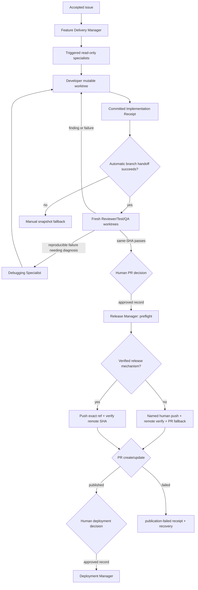

# Feature Delivery Manager - Design

This is the design of record for delivering one already-accepted GitHub issue. It
is intentionally separate from the backlog-maintainer system: the backlog system
decides and approves issue changes; this system implements accepted scope, gathers
evidence, and pauses for human publication and deployment decisions.

Agent files under `.github/agents/` derive from this document. They must reference
the existing skills and specs rather than repeat their guidance.

## Evidence and capability baseline

The table distinguishes a verified capability from a desired one. "Observed" means
it was available in the Copilot App session that created this design on 2026-08-10;
"documented" links to the platform documentation. No row grants a permission by
implication.

| Capability | Status and evidence | Safe use or fallback |
| --- | --- | --- |
| Custom-agent files in `.github/agents/*.agent.md` with `name`, `description`, `tools`, `agents`, and `user-invocable` frontmatter | Documented for VS Code and Copilot cloud agent in [custom-agent configuration](https://code.visualstudio.com/docs/agent-customization/custom-agents) and [GitHub custom agents](https://docs.github.com/en/copilot/how-tos/use-copilot-agents/coding-agent/create-custom-agents). Existing agents use this format. | Use only the documented fields. A missing tool is ignored by the host, so an agent must report a blocker rather than assume a named tool exists. |
| Path instructions under `.github/instructions/*.instructions.md` | Documented by [repository custom instructions](https://docs.github.com/en/copilot/how-tos/configure-custom-instructions-in-your-ide/add-repository-instructions-in-your-ide); existing files use YAML `applyTo`. | `applyTo` accepts comma-separated glob patterns. It is verified for VS Code, Copilot cloud agent, and code review; this task does **not** assert it for the Copilot App session runtime. The App fallback is to attach the selected files to each child prompt and record that in the Delivery Brief. |
| Copilot App tracked child sessions | Observed: `create_session`, `get_session`, `list_sessions_and_chats`, `send_session_message`, and `session_store_sql` are available. | Create a named child with `coordinate_with_creator: true`; its final response is the hand-off artifact. Pull it from the local transcript. A message is a best-effort nudge only, never an artifact transport. |
| Child worktree isolation | Observed: each created local project session is a separate worktree and branch. | The Developer alone owns its mutable worktree. Do not share or check out that live branch in another worktree. |
| Create a child from an existing branch | Observed: `create_session` accepts `base_branch` and creates a new local child worktree/branch from it. | After a Developer commit, freeze the source branch and create each phase session with `base_branch` set to the receipt branch. The phase must verify `HEAD` equals the receipt SHA before work. |
| Start a child worktree from an arbitrary receipt SHA | **Not verified.** The current surface does not expose a branch-at-SHA creation tool. | The normal hand-off uses the frozen Developer branch, whose tip is the receipt SHA. If the branch cannot be resolved, has moved, or the child starts at another `HEAD`, stop and use the documented manual snapshot fallback. Never substitute a detached checkout or a live Developer branch. |
| Session messages | Observed, but child delivery and child tool inheritance are not guaranteed. | Include all inputs in a kickoff prompt. Retrieve the terminal artifact from the transcript. Use one message only to request a missing artifact. |
| In-process subagents | Documented for VS Code/CLI (`agent` plus an `agents` list); not verified in this App session. | App sessions are the primary route. On a surface without tracked sessions, use a documented in-process subagent only if it can preserve the phase boundary; otherwise stop and name the next manual role. |
| Live GitHub MCP read/write names | **Configuration mismatch.** `.github/mcp.json` configures a `github` server with `tools: ["*"]`, but this session exposes GitHub-oriented built-ins and `gh`, not a discoverable `github/*` MCP toolset. | Do not add `github/*` to new frontmatter. Use no GitHub tools for read-only roles. Release Manager is a human-invocable, approval-refusing placeholder until a human verifies exact PR read/write MCP names and replaces wildcard access with its minimal allowlist. |
| Pull-request write operation | Observed as the App's `create_pull_request` and `update_pull_request` built-ins; no verified configurable custom-agent name is exposed in this App session. | The Release Manager owns publication. Until a verified agent-accessible write mechanism exists, the human performs the approved release operation as the named manual fallback and records its receipt; never attribute a built-in action to a child agent. |
| Generic command execution | Available on Developer, Test Engineer, QA Engineer, and Deployment Manager target roles; it can run arbitrary Git, GitHub, or deployment commands. No scoped sandbox or isolated credentials was verified. | Boundaries for execution-bearing roles are behavioral, not structural: use isolated worktrees, no credential injection, exact-command logging, and no `git push`, `gh`, `swa deploy`, Azure, or Terraform-apply command outside the approved role and gate. Residual risk remains. |
| Credentials | `gh` is available in the environment, but token scope, Azure/SWA credentials, executing identity, and session credential isolation are unverified. | Never add tokens to files, prompts, or artifacts. Do not attempt credential discovery. Approval is not authorization: deployment remains blocked until a human either performs it in an authorized surface or verifies the executing identity and named mechanism out of band. |

The required GitHub MCP capability is therefore not available for structural
publication enforcement. This blocks only the Release Manager's automated write
configuration; it never authorizes adding `github/*`, broadening execution, or using
shell access as an undocumented replacement.

## Current inventory

| Surface | Current inventory | Delivery use |
| --- | --- | --- |
| Agents | Six backlog agents: `backlog-maintainer`, `backlog-explorer`, `backlog-shaper`, `backlog-prioritizer`, `issue-writer`, and `issue-reviewer` | A separate backlog lifecycle. Do not reuse its GitHub permissions for delivery. |
| Skills | `react-app`, `validate-app`, `run-app-locally`, `triage-accessibility`, `swa-deploy`, `azure-static-web-apps`, `shape-backlog-idea` | Select only when the Delivery Brief's modified paths and risks trigger them. |
| Shared guidance | Root `AGENTS.md`; `src/AGENTS.md`; `content/AGENTS.md`; `.github/copilot-instructions.md`; `docs/specs/`; and the existing article, component, and test instructions | Apply root guidance, then the nearest subtree `AGENTS.md`, selected path instructions, and applicable specs. The Brief records all that apply. |
| Source scopes | `src/src/pages`, `src/src/components`, `src/src/core`, `src/plugins`, `content`, `.github/workflows`, `infra`, and `src/public/staticwebapp.config.json` | The scoped instruction map below maps these paths without a catch-all rule. |
| GitHub configuration | `.github/mcp.json` configures `github` with wildcard `tools: ["*"]`; existing backlog agents also name `github/*`. Neither proves a live named tool in this App session. | Delivery agents do not inherit wildcard permissions or depend on those names. A future verified Release Manager allowlist must replace, never inherit, wildcard access. |

## Roles and boundaries

| Role | Owns | Tools/boundary | Must not do |
| --- | --- | --- | --- |
| Feature Delivery Manager | Route accepted scope, select specialists and instructions, track SHA-bound artifacts, request approvals | Read/search/session coordination only; structural for file mutation in its declared allowlist | Edit, execute, build, publish, deploy, or decide backlog scope |
| Developer | Implement the accepted Delivery Brief in one mutable branch/worktree | Read/search/edit/execute; execution boundary is behavioral | Publish, deploy, change scope, or waive findings |
| Code Reviewer | Compare one receipt SHA with the brief, selected instructions, and specs | Read/search only; structural in declared allowlist | Edit, execute, publish, deploy |
| Test Engineer | Run deterministic checks and return raw evidence for one receipt SHA | Read/search/execute; behavioral execution boundary | Edit, treat a failure as acceptable, publish, deploy |
| QA Engineer | Check observable journeys, responsive behavior, a11y, themes, reduced motion, and SSR/prerender when relevant | Read/search/execute/browser; behavioral execution boundary | Edit, downgrade defects, publish, deploy |
| Debugging Specialist | Diagnose a reproducible Review, Test, or QA failure on one receipt SHA and return evidence and a remediation hypothesis | Read/search/execute; behavioral execution boundary | Edit, publish, deploy, or choose a scope-changing fix |
| Orchestration Maintainer | Investigate and fix a confirmed critical delivery-orchestration defect after a completed process | Owns only orchestration docs, agent definitions, validation fixtures, and tests in an isolated maintenance session; returns a commit-bound remediation receipt | Change product scope/code, bypass approvals, publish, deploy, or silently alter policy |
| Release Manager | Publish the exact approved source SHA and create or update its PR after independent Approval Record validation | Owns release preflight and push → remote-SHA verification → PR sequencing. Uses only a verified release mechanism; otherwise emits a blocked receipt with the named human fallback | Edit code, merge, change payload, substitute refs, or silently retry |
| Deployment Manager | Execute the exact approved SHA, environment, and named mechanism | Execute only after independent Approval Record validation; behavioral boundary | Edit code, create or merge a PR, substitute a SHA, target, or mechanism |

The eight on-demand specialists are **React**, **Frontend**, **Accessibility**,
**GitHub Actions**, **Terraform**, **Azure**, **Security**, and **Debugging**. They
are not mandatory pipeline phases. The Delivery Brief selects the first seven only
when their trigger matches: React/SSR, UI/layout, WCAG, `.github/workflows/**`,
`infra/**`, SWA/deployment configuration, or secrets/permissions/dependencies/input
respectively. It selects Debugging only for a reproducible Review, Test, or QA failure
that needs diagnosis beyond the original evidence. Its guidance is evidence and a
remediation hypothesis, not a fix or scope decision. A disagreement affecting scope,
security, user behavior, or delivery risk becomes a Decision Request for the human.

## Scoped instruction map and selection

The intended instruction files are narrow and additive. Existing article and
component scopes are retained; test coverage expands from `*.test.tsx` to all
TypeScript test conventions. Each applies together with the root instructions and
the applicable specs.

| File | Verified `applyTo` | Excludes by construction |
| --- | --- | --- |
| `articles.instructions.md` | `content/articles/*.md` | Data JSON and application code |
| `components.instructions.md` | `src/src/components/**/*` | Pages, core, and tests outside components |
| `tests.instructions.md` | `**/*.test.ts,**/*.test.tsx,**/*.spec.ts,**/*.spec.tsx` | Production TypeScript |
| `react-pages.instructions.md` | `src/src/pages/**/*,src/src/routes.tsx,src/src/App.tsx,src/src/entry-server.tsx,src/src/main.tsx` | Components and build tooling |
| `build-tooling.instructions.md` | `src/vite.config.ts,src/tailwind.config.ts,src/plugins/**/*,src/scripts/**/*` | Runtime page code |
| `content-data.instructions.md` | `content/data/**/*.json,src/src/core/data.ts,src/src/core/articles.ts,src/src/types/**/*` | Markdown articles |
| `github-actions.instructions.md` | `.github/workflows/**/*,.github/actions/**/*` | Agent/skill definitions |
| `terraform.instructions.md` | `infra/**/*.tf` | Azure application configuration |
| `azure-static-web-apps.instructions.md` | `src/public/staticwebapp.config.json,.github/workflows/deploy-app.yml,.github/workflows/reusable-deploy-static-web-app.yml` | Other workflow and Terraform paths |
| `agent-definitions.instructions.md` | `.github/agents/**/*.agent.md` | Skills and general documentation |
| `agent-system-docs.instructions.md` | `docs/agents/**/*.md,.github/skills/**/*.md` | Product and source documentation |

For each Delivery Brief, the manager lists matching files and explicit exclusions.
For example, a route change selects the React-page scope and any test scope, not
Terraform, Azure, or workflow rules. A source-to-deploy change may select multiple
matching scopes but never an unrelated specialist.

The source platform can show loaded instruction references in VS Code, but the
Copilot App session has no equivalent observable assertion. A Node validation fixture
will verify the repository's intended positive and negative path matches. Before
release, a human must also complete this manual verification: record the surface and
version, each representative path, the loaded instruction references, negative
non-matches, date, and outcome in the PR. This is release-blocking because it verifies
host behavior rather than merely the fixture's glob interpretation.

## Session and SHA contract

1. The manager creates one Developer child session/worktree for the accepted issue.
   Before implementation, the Developer reports its initial `HEAD`; the manager records
   equality with the Delivery Brief's base SHA. A mismatch blocks the cycle and requires
   a human-created branch at that SHA. The Developer is its sole mutable owner.
2. The Developer commits before hand-off and returns an Implementation Receipt containing
   the local branch, exact SHA, parent/base SHA, changed paths, and session ID. The manager
   freezes that source branch for downstream hand-off. The commit is the input to later
   work; uncommitted files are never an artifact.
3. Every Review, Test, QA, and Debugging phase needs a fresh distinct child
   branch/worktree. The manager creates and dispatches it automatically with
   `create_session`, using the Implementation Receipt's frozen source branch as
   `base_branch`, and includes the receipt SHA plus all phase inputs in the kickoff prompt.
   The phase verifies its `HEAD` equals the receipt SHA before doing work; the manager
   records the phase session ID, branch, and equality evidence. The manager must not pause
   for, or ask the human to create, this worktree during the normal path.
4. If `create_session` cannot resolve the receipt branch, the source branch moved after the
   receipt, or the child reports a different `HEAD`, stop the phase and use the manual
   snapshot fallback. The fallback record includes branch, SHA, session ID, and `HEAD`
   command output; a live Developer branch or detached checkout is not a substitute. This
   fallback is exceptional failure handling, not a normal approval or user hand-off gate.
5. A Developer commit invalidates every Review, Test, QA, and Debugging artifact for an
   older SHA. Recreate snapshots and receipts from the new receipt.
6. The manager alone creates and tracks sessions. Children do not route siblings,
   create replacements, or rely on shared memory. A terminal artifact is pulled from
   its transcript and its provenance is recorded.
7. Before release, the Release Manager verifies that the exact local branch contains the
   receipt SHA and that the approved source branch is not already mapped to a different
   remote SHA. Publication is push the exact branch/ref, verify the remote ref resolves
   to the receipt SHA, then create/update the PR. A local commit is never treated as
   published.

## Artifacts and gates

Every artifact includes `delivery_id`, issue number/URL, source branch, source commit
SHA, input references, status (`pass`, `fail`, `blocked`, `needs-approval`,
`awaiting-publication`, `publication-failed`, or `published`), timestamp, and session ID
where applicable. Release artifacts also include remote name/ref, remote-SHA status,
operation attempt number, exact command/tool outcome, and a recovery reference.

| Artifact | Required contents |
| --- | --- |
| Delivery Brief | Accepted issue, objective, constraints, in/out scope, base branch/SHA, modified-path assessment, selected and excluded instructions, specialist triggers, checks, publication/deployment intent |
| Specialist Guidance | Role, source SHA, facts/citations, selected guidance/specs considered, recommendations, verification, blockers |
| Decision Request | Conflict, impact on scope/security/user behavior/delivery risk, options, and exact human decision needed |
| Implementation Receipt | Changed paths, committed branch/SHA, commands/results, limits, and referenced brief/guidance |
| Review Verdict / Test Receipt / QA Verdict | Source SHA, status, selected instructions/specs assessed, evidence, and actionable remediation |
| Approval Record | Exact action; repository; source branch/SHA; exact PR payload or environment/mechanism; invalidation rules; and a verbatim human approval quote or unambiguous approval-message reference |
| Release Proposal/Receipt | Approval Record reference, one SHA, approved repository/base/head/title/body, local and remote ref evidence, push/PR attempt outcome, and resulting PR URL/status or a durable failure plus named recovery action |
| Deployment Proposal/Receipt | Approval Record reference, one SHA, approved environment/mechanism, authorization evidence, and resulting deployment URL/status or a durable failure plus named recovery action |

After green Review, Test, and QA receipts for the same SHA, the manager presents a PR
proposal with repository, source branch/SHA, base, exact title, and exact body. The
human may approve, edit, defer, reject, or cancel. Edit invalidates the proposal;
defer pauses; reject/cancel ends it. PR approval never authorizes deployment. Approval
moves the delivery to `awaiting-publication`; it does not imply that a local branch is
visible on GitHub.

The Release Manager validates the record and performs the exact release mechanism. The
required order is: local SHA/branch preflight, push exact source ref, remote SHA
verification, PR create/update, and release receipt. If any step fails, the manager
records `publication-failed` with the verbatim error, preserved Implementation Receipt,
attempt number, current remote-ref evidence, and one safe recovery action. A retry is a
new release attempt against the same still-valid Approval Record only after preflight;
changed SHA, payload, base/head, or target requires new approval. If no verified release
mechanism is available, the Release Manager emits the same blocked receipt and names
the human operator as the manual owner of the exact push/remote-verification/PR
sequence.

A separate Deployment Proposal names the repository, published SHA, `preview` or
`production` environment, and mechanism. The same five human actions apply. A new
commit, changed PR title/body/base/head, changed environment/mechanism, or scope change
invalidates the relevant Approval Record. Deployment requires a published release
receipt, independent authorization for its executing identity and named mechanism, and
its own receipt. Neither role merges, substitutes targets, or injects tokens; retries
must be explicit and recorded.

## Post-delivery critical-incident self-improvement

After every completed delivery, the manager performs a short retrospective over the
Delivery Brief, all phase artifacts, release/deployment receipts, and failure records.
This is mandatory even when the delivery succeeds. A **critical orchestration issue** is
any defect that can lose an artifact, misidentify a SHA/branch, skip a required gate,
misrepresent publication/deployment, route work to an unauthorized role, or make a
failure unrecoverable. Product defects and ordinary implementation failures remain in
their normal delivery path and do not trigger policy self-modification.

When a critical issue is found, the manager MUST:

1. freeze the affected delivery state and preserve the original receipts and exact error;
2. produce a Critical Orchestration Incident Record with delivery ID, phase, evidence,
   impact, root-cause hypothesis, confidence, affected rules/files, and a safe recovery;
3. investigate the orchestration definitions and validation fixtures before proposing a
   fix; never infer a platform capability or silently widen permissions;
4. create an isolated Orchestration Maintainer session to implement only the smallest
   documentation/configuration/fixture fix, run targeted validation, and return a
   commit-bound Remediation Receipt;
5. re-run the failed gate against the corrected contract when possible, or record why it
   cannot be reproduced; and
6. report the remediation commit and residual risk to the human. The manager MUST NOT
   merge, publish, deploy, change the accepted product scope, or mark the original
   delivery successful because the orchestration fix landed.

The self-improvement loop is idempotent: one incident ID gets one remediation attempt
until a human explicitly requests another iteration. A fix that changes role tools,
approval policy, publication/deployment ownership, or artifact schemas is itself
release-blocking documentation/configuration work and requires the normal review and
human publication gates.

## Flow and failure routing

Any failed required check, unresolved high-confidence finding, missing exact-SHA
snapshot, missing tool, invalid approval, missing remote ref, or remote SHA mismatch
blocks publication. The manager reports the blocker and next manual role; it never skips
a phase or changes scope to force a green result. A failed PR attempt is not a published
state and never authorizes deployment.

## Failed delivery fixture: issue #373

This is preserved evidence for orchestration testing, not an active delivery. The
Developer committed `176778cd5e0a12396ca1b98da956360f5aab1a32` on local branch
`lfarci-super-robot`, but the branch was never pushed to GitHub. The subsequent
`gh pr create --repo lfarci/loganfarci.com --base main --head lfarci-super-robot ...`
failed because GitHub had no head ref: `Head sha can't be blank, Base sha can't be
blank, No commits between main and lfarci-super-robot, Head ref must be a branch`.
The root cause was not the commit or issue content; it was an incomplete publication
handoff and an unowned push/remote-verification step. Recovery must retain the
Implementation Receipt, verify the local SHA, publish the exact branch through the
Release Manager or its named human fallback, verify the remote SHA, and only then
retry PR creation under the same or a newly validated Approval Record.

## Residual risk and release conditions

Tool allowlists do not structurally prevent arbitrary shell-based mutation on roles
with `execute`. Until the host provides scoped execution and isolated credentials,
execution-bearing roles must log exact commands, use a fresh isolated worktree, avoid
credentials, and follow their role-specific boundary. Release publication is limited to
the exact approved push/remote-verification/PR sequence; deployment remains separately
gated. This residual risk is explicit and does not weaken approval gates.

Before enabling automated release work, a human must verify the exact live GitHub MCP
read/write names, replace `.github/mcp.json` wildcard access with only the required
release tools, and update this capability table and the Release Manager frontmatter.
Until then, the named human fallback owns the approved release sequence; the wildcard
configuration is not evidence that a child agent can use GitHub publication tools. Automated
phase hand-off is limited to `create_session(base_branch=<frozen receipt branch>)` plus
child-reported `HEAD` equality; any branch-resolution or equality failure follows the
manual snapshot fallback. Before enabling automated deployment, a human must verify the
executing identity and named mechanism without exposing credentials.
