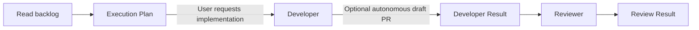

# Simple Delivery Workflow

This is the entire active agent workflow: **Orchestrator -> Developer -> Reviewer**.
It deliberately does not use child sessions, `create_session`, `get_session`,
`send_session_message`, transcript queries, shared worktrees, startup acknowledgements,
or cross-session artifacts.

## Why this is small

The host's in-process `agent` invocation returns the delegated agent's final response
to the caller. That returned response is the handoff. The Orchestrator MUST stop if it
cannot obtain a complete returned response; it MUST NOT create a session or infer the
result from a branch, diff, status message, or partial output.

## Roles

| Role | Owns | May do | Must not do |
| --- | --- | --- | --- |
| Orchestrator | Choose one backlog item, create one execution plan, route the two calls, and report the result | Read/search the repository and live backlog; invoke Developer and Reviewer in-process | Edit code, execute commands, create sessions, write GitHub state, push, create a PR, publish, deploy, or fix review findings |
| Developer | Implement one approved execution plan and autonomously create one pre-review draft PR | Read/search/edit/execute and commit local code; during approved implementation, use the existing `git push` and `gh pr create` workflow to push the completed branch and create exactly one draft PR | Expand scope, create sessions, publish, deploy, invoke Reviewer, or create more than one draft PR |
| Reviewer | Independently assess the Developer's result | Read/search/execute scoped checks | Edit, commit, push, create sessions, publish, deploy, or invoke Developer |

## Flow

1. The Orchestrator reads the live backlog when the request needs it. If that read is
   unavailable, it reports the blockage; it does not invent or use a stale backlog.
2. It selects one item only and returns an **Execution Plan** with: target, objective,
   in-scope work, out-of-scope work, likely paths, and existing checks to run.
3. The Orchestrator invokes Developer only after the user requests implementation or
   explicitly approves the plan. The entire plan is included in the invocation.
4. During approved implementation, Developer may autonomously use its existing `execute`
   capability for the `git push` and `gh pr create` workflow to push the completed branch
   and create exactly one draft pull request. This occurs before Reviewer runs: the draft
   PR is explicitly pre-review, not contingent on a later Reviewer pass, and does not alter
   Reviewer's independent review. Developer records the PR URL and outcome in its Developer
   Result. This path is subject to the publication capability gate below.
5. Developer's final response is a **Developer Result**. The Orchestrator passes that
   result verbatim with the plan to Reviewer in the next in-process invocation.
6. Reviewer's final response is a **Review Result**. The Orchestrator reports it and
   stops. A `needs-changes` result never triggers an automatic repair loop. No agent
   changes the draft PR after review in this simple workflow.

## Handoff contracts

The terminal response is the sole artifact for each delegated-agent handoff. The optional
pre-review draft PR is performed by Developer before its terminal response; it creates no
further agent handoff or session.

## Publication capability

- **Status:** Conditional. Generic `execute` is behavioral control only and does not itself
  establish an authenticated publication capability.
- **Runtime evidence:** Immediately before publication, Developer runs `gh auth status` to
  verify scoped GitHub authentication and `git push --dry-run origin HEAD` to verify
  authenticated remote write access. Both must succeed.
- **Failure routing and manual fallback:** If either check is unavailable or fails, Developer
  does not attempt `git push` or `gh pr create`. Its Developer Result records publication as
  blocked and directs the user to authenticate, push the committed branch, and create the
  draft PR manually. Developer does not substitute another tool or role.

### Developer Result

- `status`: `complete` or `blocked`
- plan target and scope implemented
- changed paths
- local commit SHA, if committed
- commands run and outcomes
- PR URL and outcome, if the autonomous draft PR was attempted
- limitations or blockers

### Review Result

- `status`: `pass`, `needs-changes`, or `blocked`
- reviewed target and Developer Result reference
- findings with file/path evidence
- commands run and outcomes
- limitations or blockers

If either response is missing a status or the required fields, the Orchestrator reports
`blocked: incomplete delegated result` and stops.

## Manual fallback

If in-process delegation is unavailable, the user runs Developer and Reviewer directly
with the same Execution Plan and Developer Result. The Orchestrator does not substitute
sessions or a different transport mechanism.
