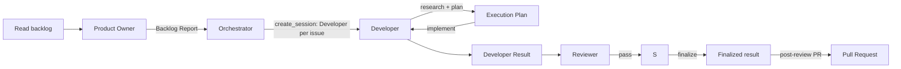

# Simple Delivery Workflow

The active agent workflow is **product-owner triage -> dispatch -> per-issue delivery**.
The Product Owner reads the live backlog and returns the authoritative ranked shortlist.
The Orchestrator dispatches one isolated **Developer** session per selected issue via
its native `create_session` capability; that agent owns research, planning,
implementation, review coordination, and the build -> review -> finalize -> PR pipeline.

This deliberately does not use transcript queries, shared worktrees, startup
acknowledgements, or cross-session artifacts between the Orchestrator and a subsession.
The Orchestrator never accesses GitHub directly, researches, plans, builds, reviews, or
publishes, and never follows up on a subsession it dispatched.

**Who triages and dispatches:** the Product Owner owns the authoritative backlog report;
the Orchestrator owns dispatch. `agent` and `create_session` are verified custom-agent
capabilities of this runtime. The Orchestrator invokes Product Owner once per backlog
request, then invokes `create_session` once per selected issue, passing the issue and
the path to this contract. Dispatch is implemented by this workflow, not delegated to an
external runtime.

## Why this is small

Backlog ownership and delivery are different concerns. The Product Owner has the sole
GitHub backlog and issue-lifecycle capability; the Orchestrator only needs its Backlog
Report and the `create_session` capability to dispatch selected work. Each issue's
research, planning, and implementation belong to an isolated subsession, so work scales
to many issues without one agent carrying every context. The Orchestrator's
`create_session` invocation is the handoff: it stops after dispatching the shortlist,
and a subsession finishes with a pull request or a blocked report.

## Roles

| Layer | Role | Owns | May do | Must not do |
| --- | --- | --- | --- | --- |
| Product management | Product Owner | Read the live GitHub backlog, recommend ranked delivery candidates, and create or update issues only when explicitly directed | Read GitHub issues through MCP, falling back to the documented read-only `gh issue list` command; use configured GitHub write tools or the documented `gh issue create` and `gh issue edit` fallback after authentication verification; return one Backlog Report | Edit code, commit, push, create a PR, create sessions, publish, deploy, research or plan delivery work, or change issue state without an explicit user directive |
| Dispatch | Orchestrator | Invoke Product Owner, select from its Backlog Report, dispatch one isolated Developer session per issue, and report the shortlist | Read/search the repository; invoke Product Owner through `agent`; invoke `create_session` once per shortlisted issue with the exact `kickoff.agent: "Developer"`, `kickoff.mode: "autopilot"`, and the issue plus this contract in the prompt; block instead of retrying with a default agent if the kickoff is rejected | Read GitHub directly, edit code, execute commands, write GitHub state, push, create a PR, publish, deploy, research or plan an issue, or fix review findings |
| Delivery | Developer | Research one issue, prepare its Execution Plan, implement it, coordinate independent review, and finalize exactly one PR after review passes | Read/search/edit/execute, invoke Reviewer, commit local code, and use the existing `git push` and `gh pr create` workflow after Reviewer passes | Expand scope, create sessions, publish, deploy, invoke agents other than Reviewer, or create a PR before review |
| Delivery | Reviewer | Independently assess the Developer's result | Read/search/execute scoped checks | Edit, commit, push, create sessions, publish, deploy, or invoke Developer |

## Flow

1. The Orchestrator first invokes Product Owner through `agent`. If that delegation is
    unavailable, it returns a blocked outcome with the exact `@product-owner` invocation
    for a human to run; it does not read GitHub directly.
2. The Product Owner reads the live backlog through GitHub MCP tools. If they are
    unavailable or return insufficient issue data, it runs the read-only fallback `gh
    issue list --state open --limit 100 --json
    number,title,labels,assignees,createdAt,updatedAt,url`. If both reads fail, it
    returns a blocked Backlog Report; it does not invent or use a stale backlog.
3. The Product Owner creates or updates an issue only for an explicit user directive. It
    prefers configured GitHub write tools and may use `gh issue create` or `gh issue
    edit` only after `gh auth status` succeeds. It records every change in its Backlog
    Report.
4. The Orchestrator accepts only a `ready` Backlog Report, selects the high-priority
    issues from it, and returns a prioritized shortlist. It never accesses GitHub,
    researches, plans, builds, reviews, or publishes an issue itself.
5. Before dispatching, the Orchestrator shows the host a **Selected Issues Overview**
    containing priority, issue number, title, URL, labels, and the concise selection
    rationale for every shortlisted issue. The overview is informational and does not
    require approval unless the user explicitly asks to review it first.
6. It dispatches one isolated Developer session per shortlisted issue via
    `create_session` with this exact kickoff: `agent: "Developer"`, `mode: "autopilot"`,
    and a complete prompt with the issue and path to this contract. It never omits the
    agent or relies on the default. If the kickoff is rejected, the Orchestrator reports
    a blocked outcome instead of retrying with an unspecified agent.
7. Developer researches the repository and prepares an **Execution Plan** with:
    target, objective, in-scope work, out-of-scope work, likely paths, and existing checks
    to run.
8. Developer implements the plan, commits the completed local change, and returns a
    **Developer Result**.
9. Developer does not create a pull request before review. The review gate is mandatory.
10. Developer invokes Reviewer in-process with the Developer Result and the plan.
    Reviewer runs the smallest existing checks that cover the change and returns a
    **Review Result**.
11. If the Review Result is `needs-changes`, Developer repairs its actionable findings
    once, then re-invokes Reviewer. This repair loop is bounded: it never exceeds one
    additional Developer + Reviewer pass. If the result is still `needs-changes` or is
    `blocked`, the session stops and reports a blocked outcome with no pull request.
12. If the Review Result is `pass`, Developer finalizes: run the
    existing quality gates and prepare PR metadata (title, description) without changing the
    reviewed code, then use the existing `git push` and `gh pr create` workflow to push that
    exact reviewed commit and create **exactly one** pull request. Finalization never edits
    code: if a code change still turns out to be needed, Developer reports `blocked` instead
    of pushing, and the session routes it back through the bounded repair pass (step 11)
    and a fresh Reviewer pass. Developer records the PR URL and outcome in its Developer Result.
13. Developer finishes with a pull request or a blocked report. It does not report back
    to the Orchestrator through any cross-session mechanism.

## Handoff contracts

The Product Owner's Backlog Report is the sole handoff to Dispatch. The Orchestrator's
`create_session` invocation is the sole handoff from Dispatch to a Developer session; the
Orchestrator makes it once per shortlisted issue after it reports the shortlist. Inside
a Developer session, the terminal response is the sole artifact for each delegated-agent
handoff (Developer Result, Review Result). The only post-review publication artifact is
the single pull request Developer creates in step 12.

## Review gate and repair loop

- Developer does not finalize or create a PR until Reviewer returns `pass`.
- A `needs-changes` result triggers at most one bounded Developer + Reviewer repair pass
  (step 11). A second `needs-changes` or a `blocked` result stops the Developer session with no
  pull request. This is not an unbounded automatic repair loop.
- Reviewer independently verifies the quality gates named in the plan and reports only
  real, actionable findings with file/path evidence.
- Finalization (step 12) never changes the reviewed code: it pushes the exact commit
  Reviewer assessed and only adds quality-gate runs or PR metadata. A code change
  discovered while finalizing goes back through the bounded repair pass (step 11) and a
  fresh Reviewer pass; it never ships straight to `git push`.

## Backlog capability

- **Product Owner invocation:** Verified. Custom agents support the `agent` tool. The
  Orchestrator is the normal workflow entry point, while Product Owner remains
  user-invocable for the documented manual fallback.
- **Backlog reads:** MCP first. If MCP does not return sufficient issue data, Product
  Owner uses the documented read-only `gh issue list` fallback. The fallback was
  authenticated and verified for this repository on 2026-08-13.
- **Issue writes:** Conditional. Product Owner creates or updates issues only for an
  explicit user directive. It prefers configured GitHub write tools; if those are not
  available, it verifies `gh auth status` before using the restricted `gh issue create`
  or `gh issue edit` fallback. If authentication or write access fails, it reports the
  intended change and directs the user to make it manually.

### Backlog Report

- `status`: `ready` or `blocked`
- repository and retrieval timestamp
- ranked candidates with number, title, URL, labels, assignees, and prioritization
  rationale
- GitHub tools or CLI commands used and outcomes
- issues created or updated during the request
- limitations, blockers, and manual fallback

## Publication capability

- **Status:** Conditional. Generic `execute` is behavioral control only and does not itself
  establish an authenticated publication capability.
- **Runtime evidence:** Immediately before publication, Developer runs `gh auth status` to
  verify scoped GitHub authentication and `git push --dry-run origin HEAD` to verify
  authenticated remote write access. Both must succeed.
- **Failure routing and manual fallback:** If either check is unavailable or fails, Developer
  does not attempt `git push` or `gh pr create`. Its Developer Result records publication as
  blocked and directs the user to authenticate, push the committed branch, and create the
  pull request manually. Developer does not substitute another tool or role.

### Developer Result

- `status`: `complete` or `blocked`
- plan target and scope implemented
- changed paths
- local commit SHA, if committed
- commands run and outcomes
- PR URL and outcome, if the post-review pull request was attempted
- limitations or blockers

### Review Result

- `status`: `pass`, `needs-changes`, or `blocked`
- reviewed target and Developer Result reference
- findings with file/path evidence
- commands run and outcomes
- limitations or blockers

If either response is missing a status or the required fields, the Developer session reports
`blocked: incomplete delegated result` and stops.

## Manual fallback

If Product Owner or the `agent` tool is unavailable, the Orchestrator returns a blocked
outcome with the exact `@product-owner` invocation for a human to run; it does not query
GitHub itself. If `create_session` or in-process delivery delegation is unavailable, the
user runs the Developer session phases directly against the same Execution Plan and Developer
Result. The Orchestrator does not substitute a different transport mechanism.
