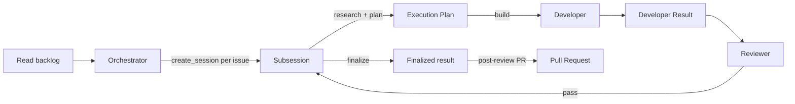

# Simple Delivery Workflow

The active agent workflow is **triage/dispatch -> per-issue delivery**. The Orchestrator
reads the live backlog, selects the high-priority issues, and dispatches one isolated
subsession per shortlisted issue via its native `create_session` capability; that
subsession owns all research and planning for its issue and drives the build -> review ->
finalize -> PR pipeline.

This deliberately does not use transcript queries, shared worktrees, startup
acknowledgements, or cross-session artifacts between the Orchestrator and a subsession.
The Orchestrator never researches, plans, builds, reviews, or publishes, and never follows
up on a subsession it dispatched.

**Who dispatches:** the Orchestrator owns dispatch. `create_session` is a verified
capability of this runtime, and the Orchestrator invokes it once per shortlisted issue,
passing the issue and the path to this contract. Dispatch is implemented by this
workflow, not delegated to an external runtime.

## Why this is small

Triaging the backlog and delivering one issue are different concerns. The Orchestrator
only needs read access to the repository, the live backlog, and the `create_session`
capability to produce and dispatch a prioritized shortlist. Each issue's research,
planning, and implementation belong to an isolated subsession, so work scales to many
issues without one agent carrying every context. The Orchestrator's `create_session`
invocation is the handoff: it stops after dispatching the shortlist, and a subsession
finishes with a pull request or a blocked report.

## Roles

| Layer | Role | Owns | May do | Must not do |
| --- | --- | --- | --- | --- |
| Dispatch | Orchestrator | Read the backlog, select the high-priority issues, dispatch one isolated subsession per issue, and report the shortlist | Read/search the repository and live backlog; read GitHub issues; invoke `create_session` once per shortlisted issue, passing the issue and this contract | Edit code, execute commands, write GitHub state, push, create a PR, publish, deploy, research or plan an issue, or fix review findings |
| Delivery | Subsession | Research its issue, produce one Execution Plan, and coordinate build -> review -> finalize -> PR | Read/search the repository; invoke Developer and Reviewer in-process; direct Developer to create the PR after review passes | Expand scope, create sessions, publish, deploy, or skip the review gate |
| Delivery | Developer | Implement one approved Execution Plan; after review passes, finalize and create exactly one PR | Read/search/edit/execute and commit local code; use the existing `git push` and `gh pr create` workflow to push the completed branch and create exactly one PR after Reviewer passes it | Expand scope, create sessions, publish, deploy, invoke Reviewer, or create a PR before review |
| Delivery | Reviewer | Independently assess the Developer's result | Read/search/execute scoped checks | Edit, commit, push, create sessions, publish, deploy, or invoke Developer |

## Flow

1. The Orchestrator reads the live backlog when the request needs it. If that read is
   unavailable, it reports the blockage; it does not invent or use a stale backlog.
2. It selects the high-priority issues and returns a prioritized shortlist. It never
   researches, plans, builds, reviews, or publishes an issue itself.
3. It dispatches one isolated subsession per shortlisted issue via `create_session`,
   passing the issue and the path to this contract.
4. The subsession researches the repository and returns an **Execution Plan** with:
   target, objective, in-scope work, out-of-scope work, likely paths, and existing checks
   to run.
5. The subsession invokes Developer in-process with the complete plan. Developer implements
   it, commits the completed local change, and returns a **Developer Result**.
6. Developer does not create a pull request before review. The review gate is mandatory.
7. The subsession invokes Reviewer in-process with the Developer Result and the plan.
   Reviewer runs the smallest existing checks that cover the change and returns a
   **Review Result**.
8. If the Review Result is `needs-changes`, the subsession routes the actionable findings
   back to Developer once for a bounded repair pass, then re-invokes Reviewer. This repair
   loop is bounded: it never exceeds one additional Developer + Reviewer pass. If the result
   is still `needs-changes` or is `blocked`, the subsession stops and reports a blocked
   outcome with no pull request.
9. If the Review Result is `pass`, the subsession directs Developer to finalize: run the
   existing quality gates and prepare PR metadata (title, description) without changing the
   reviewed code, then use the existing `git push` and `gh pr create` workflow to push that
   exact reviewed commit and create **exactly one** pull request. Finalization never edits
   code: if a code change still turns out to be needed, Developer reports `blocked` instead
   of pushing, and the subsession routes it back through the bounded repair pass (step 8)
   and a fresh Reviewer pass. Developer records the PR URL and outcome in its Developer Result.
10. The subsession finishes with a pull request or a blocked report. It does not report back
    to the Orchestrator through any cross-session mechanism.

## Handoff contracts

The Orchestrator's `create_session` invocation is the sole handoff from the Dispatch layer
to a subsession; the Orchestrator makes it once per shortlisted issue after it reports the
shortlist. Inside a subsession, the terminal response is the sole artifact for each
delegated-agent handoff (Developer Result, Review Result). The only post-review
publication artifact is the single pull request Developer creates in step 9.

## Review gate and repair loop

- The subsession does not direct Developer to finalize or create a PR until Reviewer
  returns `pass`.
- A `needs-changes` result triggers at most one bounded Developer + Reviewer repair pass
  (step 8). A second `needs-changes` or a `blocked` result stops the subsession with no
  pull request. This is not an unbounded automatic repair loop.
- Reviewer independently verifies the quality gates named in the plan and reports only
  real, actionable findings with file/path evidence.
- Finalization (step 9) never changes the reviewed code: it pushes the exact commit
  Reviewer assessed and only adds quality-gate runs or PR metadata. A code change
  discovered while finalizing goes back through the bounded repair pass (step 8) and a
  fresh Reviewer pass; it never ships straight to `git push`.

## Publication capability

- **Status:** Conditional. Generic `execute` is behavioral control only and does not itself
  establish an authenticated publication capability.
- **Runtime evidence:** Immediately before publication, Developer runs `gh auth status` to
  verify scoped GitHub authentication and `git push --dry-run origin HEAD` to verify
  authenticated remote write access. Both must succeed.
- **Failure routing and manual fallback:** If either check is unavailable or fails, Developer
  does not attempt `git push` or `gh pr create`. Its Developer Result records publication as
  blocked and directs the user to authenticate, push the committed branch, and create the
  pull request manually. Developer does not substitute another tool or role.

### Developer Result

- `status`: `complete` or `blocked`
- plan target and scope implemented
- changed paths
- local commit SHA, if committed
- commands run and outcomes
- PR URL and outcome, if the post-review pull request was attempted
- limitations or blockers

### Review Result

- `status`: `pass`, `needs-changes`, or `blocked`
- reviewed target and Developer Result reference
- findings with file/path evidence
- commands run and outcomes
- limitations or blockers

If either response is missing a status or the required fields, the subsession reports
`blocked: incomplete delegated result` and stops.

## Manual fallback

If `create_session` or in-process delegation is unavailable, the user runs the
subsession phases directly against the same Execution Plan and Developer Result. The
Orchestrator does not substitute a different transport mechanism.
