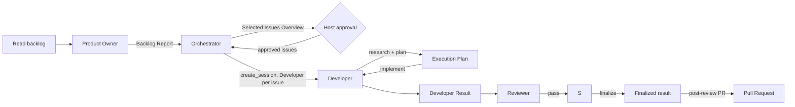

# Simple Delivery Workflow

The active agent workflow is **product-owner triage -> dispatch -> per-issue delivery**.
The Product Owner reads the live backlog and returns the authoritative ranked shortlist.
After explicit host approval, the Orchestrator dispatches one isolated **Developer**
session per selected issue via its native `create_session` capability; that agent owns
research, planning, implementation, review coordination, and the build -> review ->
finalize -> PR pipeline.

This deliberately does not use transcript queries, shared worktrees, startup
acknowledgements, or cross-session artifacts between the Orchestrator and a subsession.
The Orchestrator never accesses GitHub directly, researches, plans, builds, reviews, or
publishes, and never follows up on a subsession it dispatched.

**Who triages and dispatches:** the Product Owner owns the authoritative backlog report;
the Orchestrator owns dispatch. `agent` and `create_session` are verified custom-agent
capabilities of this runtime. The Orchestrator invokes Product Owner once per backlog
request, shows the selected issues, and invokes `create_session` once per approved issue,
passing the issue and the path to this contract. Dispatch is implemented by this workflow,
not delegated to an external runtime.

## Why this is small

Backlog ownership and delivery are different concerns. The Product Owner has the sole
GitHub backlog and issue-lifecycle capability; the Orchestrator only needs its Backlog
Report and the `create_session` capability to dispatch selected work. Each issue's
research, planning, and implementation belong to an isolated subsession, so work scales
to many issues without one agent carrying every context. The Orchestrator's
`create_session` invocation is the handoff: it stops after dispatching the shortlist,
and a subsession finishes with a pull request or a blocked report.

## Roles

| Layer | Role | Owns | May do | Must not do |
| --- | --- | --- | --- | --- |
| Product management | Product Owner | Read the live GitHub backlog, recommend ranked delivery candidates with evidence-based selection reasoning, and create or update issues only when explicitly directed | Read GitHub issues through MCP, falling back to the documented read-only `gh issue list` command; read full details for recommended issues; use configured GitHub write tools or the documented `gh issue create` and `gh issue edit` fallback after authentication verification; return one Backlog Report | Edit code, commit, push, create a PR, create sessions, publish, deploy, research or plan delivery work, or change issue state without an explicit user directive |
| Dispatch | Orchestrator | Invoke Product Owner, select from its Backlog Report, show the proposed Developer sessions, request approval, then dispatch approved issues | Read/search the repository; invoke Product Owner through `agent`; show the Selected Issues Overview and wait for explicit approval; then invoke `create_session` once per approved issue with the exact `kickoff.agent: "Developer"`, `kickoff.mode: "autopilot"`, the issue, an explicit PR base branch, and this contract in the prompt; block instead of retrying with a default agent if the kickoff is rejected | Read GitHub directly, edit code, execute commands, write GitHub state, push, create a PR, publish, deploy, research or plan an issue, fix review findings, or dispatch before explicit approval |
| Delivery | Developer | Research one issue, prepare its Execution Plan, implement it, coordinate independent review, and finalize exactly one PR after review passes | Read/search/edit/execute, invoke user-invocable Reviewer, commit local code, verify the remote PR base, and use the existing `git push` and noninteractive `gh pr create` workflow after Reviewer passes; remain user-invocable so the App can select it for `create_session` | Expand scope, create sessions, deploy, invoke agents other than Reviewer, publish anything other than the exact reviewed commit's one post-review PR, or create a PR before review |
| Delivery | Reviewer | Independently assess the Developer's result | Read/search/execute scoped checks; remain user-invocable so Developer can select it | Edit, commit, push, create sessions, publish, deploy, or invoke Developer |

## Flow

1. The Orchestrator first invokes Product Owner through `agent`. If that delegation is
    unavailable, it returns a blocked outcome with the exact `@product-owner` invocation
    for a human to run; it does not read GitHub directly.
2. The Product Owner reads the live backlog through GitHub MCP tools. If they are
    unavailable or return insufficient issue data, it runs the read-only fallback `gh
    issue list --state open --limit 100 --json
    number,title,labels,assignees,createdAt,updatedAt,url`. If both reads fail, it
    returns a blocked Backlog Report; it does not invent or use a stale backlog.
3. The Product Owner creates or updates an issue only for an explicit user directive. It
    prefers configured GitHub write tools and may use `gh issue create` or `gh issue
    edit` only after `gh auth status` succeeds. It records every change in its Backlog
    Report.
4. The Orchestrator accepts only a `ready` Backlog Report, selects the high-priority
    issues from it, and returns a prioritized shortlist. It never accesses GitHub,
    researches, plans, builds, reviews, or publishes an issue itself.
5. Before dispatching, the Orchestrator shows the host a **Selected Issues Overview**
    containing priority, issue number, title, URL, labels, and the concise selection
    rationale for every shortlisted issue, including Product Owner's selection criteria,
    material tradeoffs, and uncertainty. It asks the host to explicitly approve the
    listed issues, then stops; the overview is a mandatory approval gate, not an
    informational message. If the host questions the shortlist or requests different
    candidates, Orchestrator re-invokes Product Owner, shows a revised overview, and
    requests fresh approval.
6. Only after explicit approval, it dispatches one isolated Developer session per approved issue via
    `create_session` with this exact kickoff: `agent: "Developer"`, `mode: "autopilot"`,
    and a complete prompt with the issue, path to this contract, and explicit PR base
    branch. It never omits the agent or relies on the default. If the kickoff is rejected,
    the Orchestrator reports a blocked outcome instead of retrying with an unspecified
    agent. Developer remains user-invocable because the App's `create_session` surface
    must resolve that exact agent; if the App reports a default-agent fallback, the
    dispatch is blocked. Every Developer session starts from the project default branch and
    uses it as the PR base, so Orchestrator always omits `base_branch`. It never uses an
    unmerged agent-configuration branch as a Developer checkout or PR base. A full delivery
    test must wait until its configuration reaches the default branch; before then,
    Orchestrator returns a blocked outcome with the manual profile-level test fallback.
7. Developer researches the repository and prepares an **Execution Plan** with:
    target, objective, in-scope work, out-of-scope work, likely paths, and existing checks
    to run.
8. Developer implements the plan, runs every quality gate named in its Execution Plan,
    and commits the completed local change. A commit is an intermediate checkpoint, not a
    terminal result: Developer continues in the same active run through review and
    finalization until it produces a pull request URL or a blocked Developer Result. A
    failed actionable, change-related quality gate triggers the quality-gate repair loop
    before review; a known failing local quality gate never proceeds to a pull request.
9. Developer does not create a pull request before review. The review gate is mandatory.
10. Developer invokes the user-invocable Reviewer custom agent in-process with the
    Developer Result and the plan. If Reviewer cannot be selected or the App reports a
    default-agent fallback, Developer returns a blocked Developer Result. Reviewer runs
    the smallest existing checks that cover the change and returns a **Review Result**.
11. If the Review Result is `needs-changes`, Developer repairs its actionable findings
    once, then re-invokes Reviewer. This repair loop is bounded: it never exceeds one
    additional Developer + Reviewer pass. If the result is still `needs-changes` or is
    `blocked`, the session stops and reports a blocked outcome with no pull request.
12. If the Review Result is `pass`, Developer finalizes: rerun the
    existing quality gates and prepare PR metadata (title, description) without changing the
    reviewed code, then use the existing `git push` and `gh pr create` workflow to push that
    exact reviewed commit and create **exactly one** pull request. If a quality gate fails,
    Developer returns to the remaining quality-gate repair cycle, then obtains a fresh
    Reviewer pass for the repaired commit; it does not publish while a known local check is
    red. Before pushing, it runs `gh auth status`,
    `git ls-remote --exit-code --heads origin <PR base>`, and `git push --dry-run origin HEAD`.
    If any check fails, Developer reports a blocked publication result without pushing.
    After the checks pass, Developer runs `git push origin HEAD` and the noninteractive
    `gh pr create --base <PR base> --head <current branch> --title <title> --body <description>`
    in the same active run; it does not stop between those commands. Developer records the
    PR URL and outcome in its Developer Result.
13. Developer finishes with a pull request or a blocked report. It does not report back
    to the Orchestrator through any cross-session mechanism.

## Handoff contracts

The Product Owner's Backlog Report is the sole handoff to Dispatch. The host's explicit
approval of the Selected Issues Overview is the required gate before the Orchestrator's
`create_session` invocation, which is the sole handoff from Dispatch to a Developer
session. The Orchestrator creates one Developer session per approved issue. Inside a
Developer session, the terminal response is the sole artifact for each delegated-agent
handoff (Developer Result, Review Result). The only post-review publication artifact is
the single pull request Developer creates in step 12.

## Review gate and repair loop

- Developer does not finalize or create a PR until Reviewer returns `pass`.
- A `needs-changes` result triggers at most one bounded Developer + Reviewer repair pass
  (step 11). A second `needs-changes` or a `blocked` result stops the Developer session with no
  pull request. This is not an unbounded automatic repair loop.
- Reviewer independently verifies the quality gates named in the plan and reports only
  real, actionable findings with file/path evidence.
- Finalization (step 12) pushes only the exact commit Reviewer assessed. A quality-gate
  failure discovered while finalizing goes through the remaining quality-gate repair loop
  and a fresh Reviewer pass; it never ships straight to `git push`.

## Quality-gate repair loop

- Developer runs the quality gates selected in its Execution Plan before requesting
  Reviewer and reruns them after Reviewer passes.
- A failed gate with an actionable, change-related cause triggers a repair and rerun of the
  failed gate plus the complete planned gate set.
- The loop allows at most two repair cycles across delivery. Any repair after review
  requires a fresh Reviewer pass for the new commit.
- Developer returns a blocked result, without a PR, when a gate remains red after two
  cycles or has an environmental or out-of-scope cause. It records the command output and
  blocker rather than publishing a knowingly failing change.
## Validation status

- **Static contract check:** Run
  `node scripts/validate-delivery-contract.mjs` from the repository root before a live
  workflow test. It is dependency-free and validates profile capabilities, approval and
  dispatch gates, independent `main`-based Developer branches, publication preconditions,
  and the two-cycle quality-gate repair loop. It does not access GitHub or exercise the
  App runtime.
- **Test 5 (2026-08-14):** Demonstrated that using an unmerged local configuration branch
  as the delivery checkout and PR base prevents GitHub PR creation. Delivery sessions now
  always start from and target the project default branch.
- **Test 6 (2026-08-14):** Confirmed that a Developer session starts on an independent
  branch from `main`. It stopped at a local quality-gate failure before review or
  publication, revealing that the prior contract did not require repair attempts. The
  quality-gate repair loop now requires up to two targeted repair cycles.
- **Pending live proof:** A minimal Developer run that reaches Reviewer, pushes its
  independent branch, and opens one PR against `main` after the quality-gate repair update.
  Repeat that smoke test after App-runtime or credential-boundary changes.

## Backlog capability

- **Product Owner invocation:** Verified. Custom agents support the `agent` tool. The
  Orchestrator is the normal workflow entry point, while Product Owner remains
  user-invocable for the documented manual fallback.
- **Developer session selection:** Conditional. `create_session` receives the explicit
  `kickoff.agent: "Developer"` argument, and Developer remains user-invocable so the App
  can resolve it. A 2026-08-13 test observed a default Copilot CLI fallback while
  Developer was non-user-invocable, despite the correct argument being supplied. Any
  reported default-agent fallback blocks delivery; the user must restart the App in a
  fresh session after committing the profile and select Developer manually if the
  fallback persists.
- **Reviewer selection:** Conditional. Reviewer remains user-invocable so Developer can
  resolve it through the `agent` tool. Test 6 stopped at a local quality gate before it
  reached review, so a full Reviewer-to-PR run remains pending. A default-agent fallback
  or unavailable Reviewer blocks delivery rather than allowing publication without
  independent review.
- **Backlog reads:** MCP first. If MCP does not return sufficient issue data, Product
  Owner uses the documented read-only `gh issue list` fallback. The fallback was
  authenticated and verified for this repository on 2026-08-13.
- **Issue writes:** Conditional. Product Owner creates or updates issues only for an
  explicit user directive. It prefers configured GitHub write tools; if those are not
  available, it verifies `gh auth status` before using the restricted `gh issue create`
  or `gh issue edit` fallback. If authentication or write access fails, it reports the
  intended change and directs the user to make it manually.

### Backlog Report

- `status`: `ready` or `blocked`
- repository and retrieval timestamp
- selection criteria and material tradeoffs or uncertainty
- ranked candidates with number, title, URL, labels, assignees, and evidence-based
  rationale for why each was selected now
- concise reasoning for why higher-ranked candidates take precedence over other relevant
  backlog items
- GitHub tools or CLI commands used and outcomes
- issues created or updated during the request
- limitations, blockers, and manual fallback

## Publication capability

- **Status:** Conditional. Generic `execute` is behavioral control only and does not itself
  establish an authenticated publication capability.
- **Runtime evidence:** Immediately before publication, Developer runs `gh auth status` to
  verify scoped GitHub authentication, `git ls-remote --exit-code --heads origin <PR base>`
  to verify the selected base is on GitHub, and `git push --dry-run origin HEAD` to verify
  authenticated remote write access. All must succeed. Authentication and remote write
  access were manually verified during the 2026-08-14 tests; the complete automated
  Reviewer-to-PR path remains pending the live proof above.
- **Failure routing and manual fallback:** If any check is unavailable or fails, Developer
  does not attempt `git push` or `gh pr create`. Its Developer Result records publication as
  blocked and directs the user to authenticate, push the PR base when appropriate, push the
  committed branch, and create the pull request manually. Developer does not substitute
  another tool or role.

### Developer Result

- `status`: `complete` or `blocked`
- plan target and scope implemented
- changed paths
- local commit SHA, if committed
- PR base branch
- commands run and outcomes
- PR URL and outcome, if the post-review pull request was attempted
- limitations or blockers

### Review Result

- `status`: `pass`, `needs-changes`, or `blocked`
- reviewed target and Developer Result reference
- findings with file/path evidence
- commands run and outcomes
- limitations or blockers

If either response is missing a status or the required fields, the Developer session reports
`blocked: incomplete delegated result` and stops.

## Manual fallback

If Product Owner or the `agent` tool is unavailable, the Orchestrator returns a blocked
outcome with the exact `@product-owner` invocation for a human to run; it does not query
GitHub itself. If `create_session` or in-process delivery delegation is unavailable, the
user runs the Developer session phases directly against the same Execution Plan and Developer
Result. Before unmerged agent-configuration changes reach the default branch, the user may
run a manual profile-level test but does not launch issue-delivery sessions from that branch.
The Orchestrator does not substitute a different transport mechanism.
