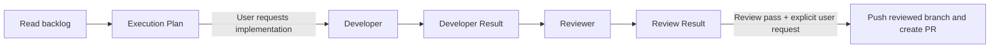

# Simple Delivery Workflow

This is the entire active agent workflow: **Orchestrator -> Developer -> Reviewer**.
It deliberately does not use child sessions, `create_session`, `get_session`,
`send_session_message`, transcript queries, shared worktrees, startup acknowledgements,
or cross-session artifacts.

## Why this is small

The host's in-process `agent` invocation returns the delegated agent's final response
to the caller. That returned response is the handoff. The Orchestrator MUST stop if it
cannot obtain a complete returned response; it MUST NOT create a session or infer the
result from a branch, diff, status message, or partial output.

## Roles

| Role | Owns | May do | Must not do |
| --- | --- | --- | --- |
| Orchestrator | Choose one backlog item, create one execution plan, route the two calls, and report the result | Read/search the repository and live backlog; invoke Developer and Reviewer in-process; only after a `pass` Review Result and an explicit user request, use scoped execution for the existing `git push` and `gh pr create` workflow to push the reviewed branch and create one PR | Edit code, execute commands other than that limited post-review workflow, create sessions, write GitHub state other than that push/PR, publish, deploy, or fix review findings |
| Developer | Implement one approved execution plan | Read/search/edit/execute and commit local code | Expand scope, create sessions, push, create a PR, publish, deploy, or invoke Reviewer |
| Reviewer | Independently assess the Developer's result | Read/search/execute scoped checks | Edit, commit, push, create sessions, publish, deploy, or invoke Developer |

## Flow

1. The Orchestrator reads the live backlog when the request needs it. If that read is
   unavailable, it reports the blockage; it does not invent or use a stale backlog.
2. It selects one item only and returns an **Execution Plan** with: target, objective,
   in-scope work, out-of-scope work, likely paths, and existing checks to run.
3. The Orchestrator invokes Developer only after the user requests implementation or
   explicitly approves the plan. The entire plan is included in the invocation.
4. Developer's final response is a **Developer Result**. The Orchestrator passes that
   result verbatim with the plan to Reviewer in the next in-process invocation.
5. Reviewer's final response is a **Review Result**. Unless that result has `status:
   pass` and the user explicitly requests a pull request, the Orchestrator reports it and
   stops. A `needs-changes` result never triggers an automatic repair loop.
6. Only with both conditions in step 5 may the Orchestrator use scoped execution solely
   for the existing `git push` and `gh pr create` workflow to push the reviewed branch and
   create one pull request. It does not edit or repair the change, make any other GitHub
   state change, or invoke another agent. It then reports the Review Result and push/PR
   outcome in its terminal response and stops.

## Handoff contracts

The terminal response is the sole artifact for each delegated-agent handoff. The optional
post-review push/PR step uses the returned Review Result directly; it creates no further
agent handoff or session.

### Developer Result

- `status`: `complete` or `blocked`
- plan target and scope implemented
- changed paths
- local commit SHA, if committed
- commands run and outcomes
- limitations or blockers

### Review Result

- `status`: `pass`, `needs-changes`, or `blocked`
- reviewed target and Developer Result reference
- findings with file/path evidence
- commands run and outcomes
- limitations or blockers

If either response is missing a status or the required fields, the Orchestrator reports
`blocked: incomplete delegated result` and stops.

## Manual fallback

If in-process delegation is unavailable, the user runs Developer and Reviewer directly
with the same Execution Plan and Developer Result. The Orchestrator does not substitute
sessions or a different transport mechanism.
