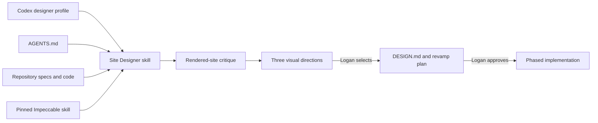

# Codex Site Designer

## Purpose

Create a Codex-first Designer setup for loganfarci.com. The Designer combines a
high-craft frontend workflow with the repository's product vision, current code,
design tokens, accessibility contract, and validation commands.

Its first assignment is to critique the current rendered site and prepare an
approval-ready plan for a full visual revamp. It must not edit the UI during that
discovery assignment.

The target identity is professional, modern, and technical: developer-native and
enterprise-credible, with the precision associated with GitHub, Microsoft, and
Avanade, but closer and friendlier in tone. It must not imitate those brands.

## Goals

- Give Codex a visible, reusable Site Designer capability for this repository.
- Use Impeccable as the primary general design-craft workflow.
- Keep repository specs and current code authoritative over generic design advice.
- Separate critique, visual-direction selection, planning, and implementation with
  explicit approval boundaries.
- Support hands-on React and Tailwind implementation after the revamp plan is approved.
- Preserve accessibility, static prerendering, performance, and content quality while
  raising the visual-design bar.

## Non-goals

- Do not make a Copilot custom agent the primary implementation.
- Do not publish, deploy, push, or create pull requests.
- Do not replace factual copy or make new professional claims without approval.
- Do not begin a full redesign before Logan selects a direction and approves the plan.
- Do not reproduce GitHub, Microsoft, or Avanade branding.
- Do not override `docs/specs/non-goals.md` or weaken the repository quality bars.

## Architecture

### Codex profile

Create `~/.codex/designer.config.toml`, selected with
`codex --profile designer`. It sets execution defaults rather than duplicating the
Designer workflow:

- `model = "gpt-5.6-sol"`
- `model_reasoning_effort = "xhigh"`
- `personality = "friendly"`
- `approval_policy = "on-request"`
- `sandbox_mode = "workspace-write"`

Other settings inherit from the user's base Codex configuration. The profile does not
grant publication, deployment, or unrestricted filesystem access.

Named profile files are supported by the Codex CLI and IDE configuration layers. If a
Codex client does not expose profile selection, the Site Designer skill remains the
behavioral entry point and the client's ordinary model and permission settings apply.

### Site Designer skill

Create `.agents/skills/site-designer/` with:

- `SKILL.md` containing the role, routing, workflow, approval gates, and result contract.
- `agents/openai.yaml` with the display name `Site Designer`, a concise description, and
  a default prompt that explicitly invokes `$site-designer` to critique the current site
  and prepare a revamp plan.

Implicit invocation remains enabled so Codex can select the skill for clear
loganfarci.com design, critique, redesign, and visual-polish requests. Explicit
`$site-designer` invocation is the reliable manual entry point.

The skill reads the applicable `AGENTS.md`, `.github/copilot-instructions.md`, path
instructions, and routed specs before acting. It loads only the references and helper
skills needed for the current phase.

### Impeccable

Install the complete Impeccable skill at `.agents/skills/impeccable/`, including its
references and scripts. Before installation, preview and inspect its full tree, license,
instructions, and executable files. Resolve the reviewed upstream revision to an
immutable commit SHA and pin that SHA; do not track a moving branch or update it
automatically.

The Site Designer uses Impeccable's relevant playbook rather than loading every command:

- `critique` for the current-state review.
- `shape` and `new-work` for the revamp workshop.
- `document` for the approved visual system.
- The relevant build or refinement playbook plus `craft-floor` during implementation.
- `audit` or `polish` for bounded finishing passes.

If Impeccable is missing, unreadable, or fails integrity review, Designer reports
degraded capability. It may complete a clearly labeled repository-only assessment, but
must ask before planning or implementing the revamp without Impeccable.

### Product and design context

Add a short root `PRODUCT.md` that routes Impeccable to the canonical requirements in
`docs/specs/README.md`, especially the vision, non-goals, architecture, accessibility,
and quality bars. It contains links and a concise precedence statement, not copied
requirements.

`DESIGN.md` does not exist merely to satisfy tooling. Designer creates it only after
Logan selects a revamp direction. It then becomes the approved visual-system source of
truth and is linked from `docs/specs/README.md`. Product requirements and non-goals
continue to outrank it.

## Workflow

### 1. Rendered-site critique

This phase is read-only with respect to UI and content source files.

1. Load repository guidance, product context, the current code, and the Impeccable
   critique playbook.
2. Start the application with the existing `run-app-locally` skill.
3. Inspect every shipped route returned by the current routing and prerender code,
   including a representative article detail route.
4. Inspect light and dark themes at representative mobile, tablet, and desktop widths.
5. Review information hierarchy, typography, layout, navigation, content presentation,
   responsive behavior, interaction states, motion, accessibility, visual consistency,
   and perceived professional identity.
6. Check keyboard focus, reduced-motion behavior, overflow, and obvious contrast issues.
7. Correlate rendered evidence with tokens, primitives, components, and page code.

Write `docs/design/current-state-critique.md`. Each finding includes the affected
surface, evidence, impact, priority, and one of `preserve`, `reconsider`, or `replace`.
Distinguish visual judgment from verified accessibility or functional defects. Do not
edit UI code during this phase.

### 2. Visual-direction workshop

Use the approved visual companion and real site content to present three genuinely
distinct directions. Each direction explains its thesis, typography character, palette
strategy, spatial system, material/elevation treatment, imagery stance, motion grammar,
and fit with Logan's professional identity.

All directions must remain content-first, accessible, responsive, and compatible with
the existing static React/Tailwind architecture. They may reference the clarity and
professional context of GitHub, Microsoft, and Avanade, but cannot clone their layouts,
tokens, illustrations, or brand assets.

Wait for Logan to select or revise a direction before documenting a new visual system.

### 3. Revamp definition

After direction approval:

1. Create `DESIGN.md` using the selected direction and verified project tokens and
   components. Mark intentional replacements explicitly; do not preserve the old visual
   world by accident.
2. Create `docs/design/revamp-plan.md` with phased, independently verifiable work:
   foundations and tokens; shared layout and navigation; page surfaces; responsive and
   motion refinement; final validation.
3. Name the affected routes, likely code paths, migration risks, acceptance criteria,
   and relevant existing checks for every phase.
4. Stop and request explicit approval.

### 4. Implementation

Implementation begins only after explicit approval of the revamp plan. Work one approved
phase at a time, preserving factual content and repository boundaries. Use existing
components, Radix primitives, semantic tokens, and platform features before adding a
dependency or custom abstraction.

For each phase, build fully, inspect desktop and mobile together, repair the resulting
batch of findings, and perform at most one confirmation pass. Do not enter an unbounded
polish loop.

## Result contract

Every invocation ends with one `Designer Result` containing:

- `status`: `critique-ready`, `direction-ready`, `plan-ready`, `complete`, or `blocked`
- phase and scope
- routes and surfaces inspected or changed
- evidence and durable artifacts
- files changed, if implementation was authorized
- commands and outcomes
- approvals received
- remaining risks, limitations, or blockers

A critique is not `critique-ready` without rendered evidence. A revamp is not
`plan-ready` without a selected visual direction, acceptance criteria, and a phased plan.
Implementation is not `complete` with a known failing required quality gate.

## Quality and validation

### Setup validation

- Validate the Site Designer skill with the bundled skill validator.
- Confirm `agents/openai.yaml` is valid and its default prompt names `$site-designer`.
- Start Codex with `--profile designer` and confirm the profile parses.
- Confirm Codex lists both `site-designer` and `impeccable` from the repository.
- Run a behavioral smoke test that asks Site Designer to critique the current site and
  verifies it does not edit UI code before approval.

### Critique validation

- Use rendered evidence from every shipped route, both themes, and representative
  mobile, tablet, and desktop widths.
- Record incomplete routes or states instead of inferring them.
- Treat automated accessibility results as evidence, not as a complete UX review.
- Keep screenshots and browser-session artifacts out of version control unless Logan
  explicitly requests a durable visual artifact.

### Implementation validation

Run focused tests while iterating. Before declaring an approved revamp phase complete,
run the existing `validate-app` skill and its complete local quality gate. Visual review
adds evidence but never replaces build, lint, formatting, tests, Lighthouse, axe, or
browser acceptance checks.

## Failure handling

- If the local app or browser cannot run, provide a labeled static-code assessment and
  return `blocked` for the rendered critique.
- If baseline checks already fail, record the command and separate the pre-existing
  failure from design findings. Do not silently broaden the revamp to repair unrelated
  defects.
- If the working tree contains overlapping user changes, preserve them and stop before
  editing the affected paths.
- If a visual direction conflicts with a non-goal, accessibility requirement, or quality
  bar, reject or revise the direction before planning it.
- If Impeccable scripts require authority beyond the active Codex permissions, request
  approval at the point of use; never weaken the profile globally.
- Never repair Impeccable drift or update the pinned skill as a side effect of ordinary
  design work.

## Success criteria

- Codex can be launched with the `designer` profile and can explicitly invoke
  `$site-designer`.
- Site Designer automatically receives repository-specific context without copying the
  canonical specs into its instructions.
- The first Designer assignment produces a rendered, evidence-backed critique and a
  phased revamp plan without editing UI code before approval.
- The selected direction expresses Logan's professional, modern, technical, and friendly
  identity without brand imitation.
- Approved implementation phases remain accessible, responsive, statically prerendered,
  and green against the repository quality gate.

## Evidence and references

- [Codex config basics](https://learn.chatgpt.com/docs/config-file/config-basic) documents
  named profile files, project configuration precedence, model settings, personality,
  approvals, and sandbox settings.
- [Build skills](https://developers.openai.com/codex/skills) documents repository skills
  under `.agents/skills`, explicit `$skill-name` invocation, automatic discovery, and
  `agents/openai.yaml` metadata.
- [Custom instructions with AGENTS.md](https://developers.openai.com/codex/guides/agents-md)
  documents layered repository guidance.
- [Impeccable on Skills.sh](https://www.skills.sh/pbakaus/impeccable/impeccable) provides
  discovery metadata; installation still requires independent source and script review.
